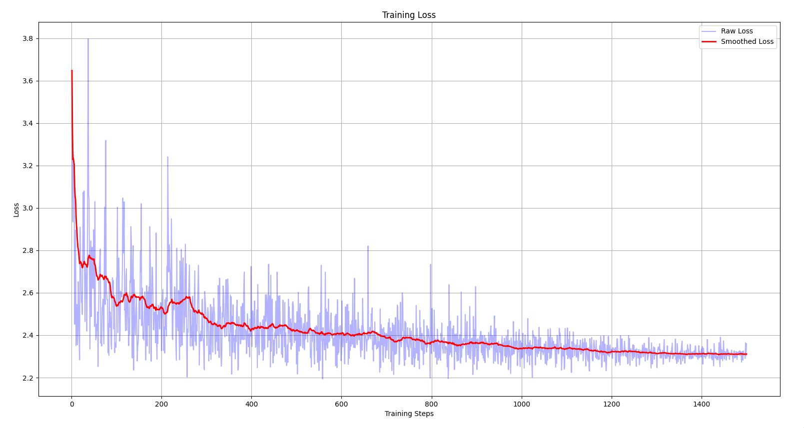
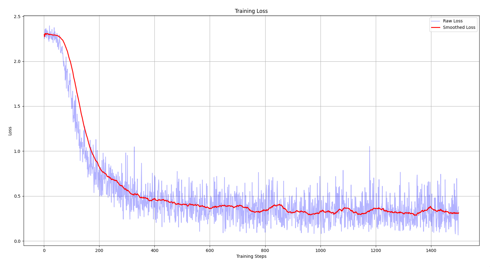
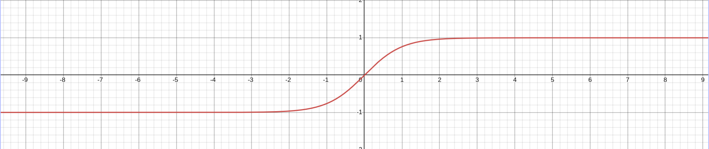
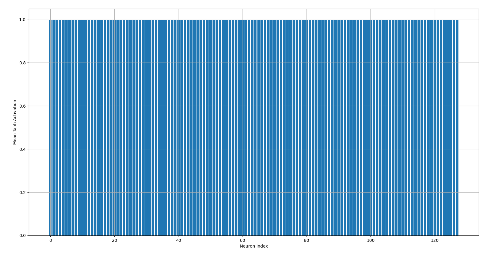
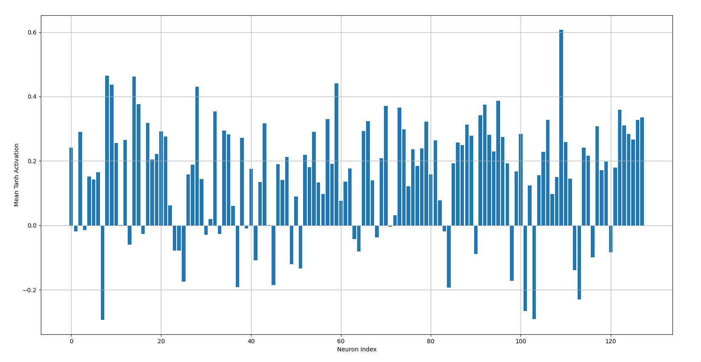
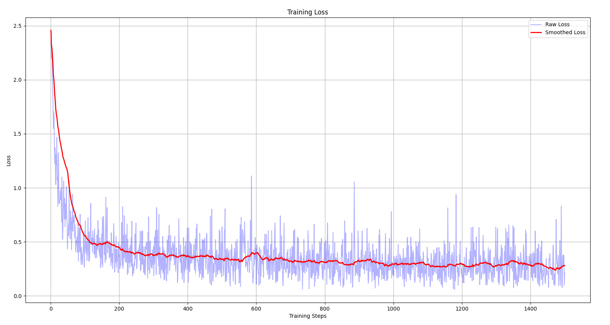
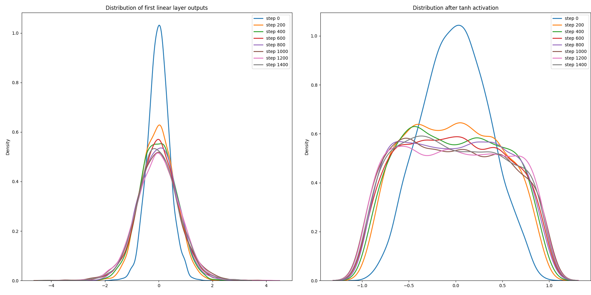
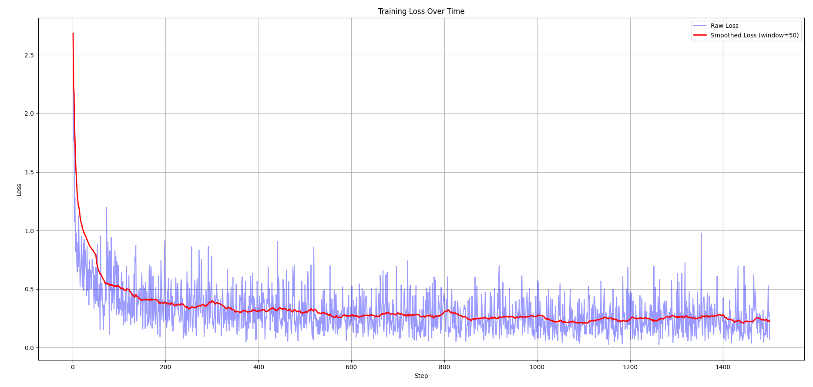

Batch normalization, or batchnorm, is a popular technique used to speed up the training of neural networks by addressing a problem known as _internal covariate shift_. It also reduces sensitivity to weight and bias initialization, which makes the training process much more stable and less dependent on careful tuning of the initial values. Before batchnorm, the weights and biases had to be carefully tuned to ensure stable and efficient training. Poor initialization could lead to either exploding or vanishing gradients, both of which are problematic when trying to train a neural network.

In this blog post, I will explain what batchnorm tries to solve, how it works, and code out an implementation of it using PyTorch. Before jumping into the details of batchnorm, let’s take a look at why weights and biases must be carefully initialized.

## Need for careful initialization

```python
import torch
import torch.nn.functional as F
import torchvision.datasets as datasets
import torchvision.transforms as transforms
import matplotlib.pyplot as plt
from abc import ABC, abstractmethod
from typing import List

BATCH_SIZE = 32
MAX_STEPS = 1_500

transform = transforms.Compose([
    transforms.ToTensor()
])

train_dataset = datasets.MNIST(
    root="data", train=True, download=True, transform=transform)
test_dataset = datasets.MNIST(
    root="data", train=False, download=True, transform=transform)

train_loader = torch.utils.data.DataLoader(
    train_dataset, batch_size=BATCH_SIZE, shuffle=True)
test_loader = torch.utils.data.DataLoader(
    test_dataset, batch_size=len(test_dataset), shuffle=True)


class Layer(ABC):
    @abstractmethod
    def __call__(self, x):
        pass

    @abstractmethod
    def parameters(self):
        pass


class Linear(Layer):
    def __init__(self, fan_in, fan_out):
        super().__init__()

        self.weight = torch.rand(
            (fan_in, fan_out)) / fan_in ** 0.5
        self.bias = torch.zeros(fan_out)

    def __call__(self, x):
        return x @ self.weight + self.bias

    def parameters(self):
        return [self.weight, self.bias]


class Tanh(Layer):
    def __init__(self):
        super().__init__()

    def __call__(self, x):
        return torch.tanh(x)

    def parameters(self):
        return []


class Model(Layer):
    def __init__(self, layers: Layer):
        super().__init__()

        self.layers: List[Layer] = layers

    def __call__(self, x):
        for layer in self.layers:
            x = layer(x)

        return x

    def parameters(self):
        parameters = []

        for layer in self.layers:
            parameters += layer.parameters()

        return parameters

    def zero_grad(self):
        for p in self.parameters():
            p.grad = None


model = Model([
    Linear(28 * 28, 128),
    Tanh(),
    Linear(128, 10)
])

parameters: List[torch.Tensor] = model.parameters()

for p in parameters:
    p.requires_grad = True

step = 0

for x, y in train_loader:
    if step >= MAX_STEPS:
        break
    x = x.view(-1, 28 * 28)
    out = model(x)
    loss = F.cross_entropy(out, y)

    print(f"step - {step + 1}; loss - {loss:.3f}")

    model.zero_grad()
    loss.backward()

    lr = 0.1 * (1.0 - step / MAX_STEPS)
    lr = max(lr, 0.01)

    for p in parameters:
        if p.grad is not None:
            p.data -= lr * p.grad

    step += 1

with torch.no_grad():
    for x_test, y_test in test_loader:
        x_test = x_test.view(-1, 28 * 28)
        x_test = model(x_test)
        loss = F.cross_entropy(x_test, y_test)
        print(f"loss: {loss.item():.3f}")
```

The code above defines a very basic neural network trained on the MNIST dataset. It consists of a single hidden layer and uses tanh as the activation function, mini-batch SGD as the optimizer, and cross-entropy as the loss function. The weights are initialized randomly using `torch.randn`, and the biases are initially set to zero.

After training the model for a maximum of 1,500 steps, it achieves a loss of around 2.3.



The loss v/s training steps plot above reveals some interesting details about the training process:

- The initial loss starts at a higher value (around 3.6 - 3.8).
- The curve shows a slow descent and contains several "plateaus" along the way.
- The loss gets stuck at around 2.3, indicating that the optimizer has reached a poor local minimum.

The reason behind the high initial loss is that, due to the randomly initialized weights, the network makes highly biased initial predictions. When this happens, the first few training steps are spent squashing down the weights before the network begins actually learning i.e. optimizing the parameters.

In a classification problem with N classes, if the network has no prior knowledge, it should ideally predict equal probabilities for all classes. If cross-entropy is used as the loss function, then the ideal initial loss would be equal to −log(1/N). So, if the initial loss during training is close to −log(1/N), then the network will work on optimizing the parameters rather than first squashing down the weights.

One way to fix this issue is to scale down the randomly initialized weights by multiplying them with some factor, such that the initial loss is close to −log⁡(1/N).

```python
class Linear(Layer):
    def __init__(self, fan_in, fan_out):
        super().__init__()

        self.weight = torch.rand((fan_in, fan_out)) * 0.01
        self.bias = torch.zeros(fan_out)
```



By simply scaling down the randomly initialized weights by a factor of 100, the optimizer reaches a far better local minimum by the end of training. The model achieves a loss of around 0.3, nearly 7.5 times better than before.

Along with bringing the initial loss closer to the ideal starting value, it also fixed the issue of _saturated `tanh`_. To understand the problem of saturated tanh, we first need to understand the nature of the `tanh` function.



`tanh` is a squashing function - it takes in any real number as the input and compresses it into the range of [−1, 1]. The `tanh` function has "plateau" regions at both ends of its graph, which means that when it's applied to a very large positive number, the output is almost equal to 1, and similarly, for a very large negative number, the output is almost equal to -1.

The derivate of $\text{tanh}(x)$ is equal to $1 - (\text{tanh}(x))^{2}$

Consider a layer in a neural network that undergoes a linear transformation, followed by a `tanh` activation function applied to the outputs. If the outputs of the linear transformation are very large, then `tanh` will return values close to either 1 or -1, depending on the sign. When the network backpropagates through `tanh`, the derivatives will be nearly zero, since the post-activation values for most of the neurons in that layer are saturated at either 1 or -1. This causes those neurons to become dead - meaning they won't learn anything during training. This issue is known as _saturated `tanh`_.



The bar chart above shows the mean post-activation values of the first hidden layer for all 128 neurons when the weights are randomly initialized without any scaling factor. Notice how the post-activation values for most of the neurons are equal to 1. This indicates that those neurons were barely learning anything during training, which also explains the high loss when the weights were not properly initialized.



This bar chart shows the case when the weights are properly initialized i.e. they are scaled down so that the outputs of the linear transformation are not too large, preventing them from being saturated after `tanh` is applied.

The issue with this approach is that it involves a lot of trial and error to determine which scaling factor yields the most optimal results and randomly using _magic numbers_ in the codebase isn't really the best practice. To overcome this issue, we can use a standard weight initialization technique such as Xavier initialization (if `tanh` activation function is used) or He initialization (if ReLU-like activation functions are used).

## Xavier Initialization

Xavier initialization is a weight initialization technique introduced in the paper _"[Understanding the Difficulty of Training Deep Feedforward Neural Networks](https://www.researchgate.net/publication/215616968_Understanding_the_difficulty_of_training_deep_feedforward_neural_networks)"_. The main idea of Xavier initialization is to keep the variance of activations and gradients roughly the same across all layers.

If the variance of activations grows too much then for activation functions like `tanh` and `sigmoid`, large values get squashed to 1 or -1. This makes the derivatives almost equal to zero, so the learning slows down.

If the variance of gradients grows too much then it causes the _exploding gradients_ problem.

If the variance of activations shrink too much then the signal going forward gets smaller and smaller, which causing underfitting in the network.

If the variance of the gradients shrinks too much then it causes the _vanishing gradients_ problem.

In Xavier initialization, the weights are sampled from:

$\mathbb{N}(0, \sigma^2), \text{ where } \sigma = \sqrt{\frac{2}{\text{fan\_in} + \text{fan\_out}}}$

PyTorch has a utility function that fills an input tensor using the Xavier initialization technique - [`torch.nn.init.xavier_normal_`](https://pytorch.org/docs/stable/nn.init.html#torch.nn.init.xavier_normal_)

```python
class Linear(Layer):
    def __init__(self, fan_in, fan_out):
        super().__init__()

        self.weight = torch.rand(
            (fan_in, fan_out))
        self.bias = torch.zeros(fan_out)

        torch.nn.init.xavier_normal_(self.weight)
```



Using Xavier initialization, the network reaches the optimal local minimum much more quickly.

## Introduction to batchnorm

> Training Deep Neural Networks is complicated by the fact that the distribution of each layer’s inputs changes during training, as the parameters of the previous layers change. This slows down the training by requiring lower learning rates and careful parameter initialization and makes it notoriously hard to train models with saturating nonlinearities. We refer to this phenomenon as _internal covariate shift_ and address the problem by normalizing layer inputs. Our method draws its strength from making normalization a part of the model architecture and performing the normalization for each training mini-batch. Batch Normalization allows us to use much higher learning rates and be less careful about initialization.

Batch normalization, or batchnorm, was introduced in the paper _“[Batch Normalization: Accelerating Deep Network Training by Reducing Internal Covariate Shift](https://arxiv.org/abs/1502.03167)”_. It helps to speed up the training process of neural networks by addressing the issue of internal covariate shift. But what is internal covariate shift?

During training, as the parameters of the earlier layers update, the distribution of their outputs (activations) changes. This means that the distribution of inputs to the next layer are constantly shifting. So when a later layer tries to learn something, it has constantly re-learn the things due to ever-changing distribution shift. This phenomenon where the distribution of activations shifts internally during, is known as _internal covariate shift_.

I've tweaked the training loop to capture the snapshots of the pre and post activation values for every 200th step and plot them at the end using `matplotlib` and `seaborn`.

```python
snapshots = {
    "step": [],
    "pre_activations": [],
    "post_activations": []
}

step = 0

for x, y in train_loader:
    if step >= MAX_STEPS:
        break

    x = x.view(-1, 28 * 28)

    pre_act = model.layers[0](x)
    post_act = model.layers[1](pre_act)

    if step % 200 == 0:
        snapshots["step"].append(step)
        snapshots["pre_activations"].append(pre_act.detach().view(-1).cpu())
        snapshots["post_activations"].append(post_act.detach().view(-1).cpu())

    out = model.layers[2](post_act)
    loss = F.cross_entropy(out, y)

    print(f"step - {step + 1}; loss - {loss:.3f}")

    model.zero_grad()
    loss.backward()

    lr = 0.1 * (1.0 - step / MAX_STEPS)
    lr = max(lr, 0.01)

    for p in parameters:
        if p.grad is not None:
            p.data -= lr * p.grad

    step += 1

with torch.no_grad():
    for x_test, y_test in test_loader:
        x_test = x_test.view(-1, 28 * 28)
        x_test = model(x_test)
        loss = F.cross_entropy(x_test, y_test)
        print(f"loss: {loss.item():.3f}")

plt.figure(figsize=(14, 6))

for i, step in enumerate(snapshots["step"]):
    plt.subplot(1, 2, 1)
    sns.kdeplot(snapshots["pre_activations"][i],
                label=f"step {step}", linewidth=2)
    plt.title("Distribution of first linear layer outputs")

    plt.subplot(1, 2, 2)
    sns.kdeplot(snapshots["post_activations"][i],
                label=f"step {step}", linewidth=2)
    plt.title("Distribution after tanh activation")

plt.subplot(1, 2, 1)
plt.legend()
plt.subplot(1, 2, 2)
plt.legend()
plt.tight_layout()
plt.show()
```



The distribution shift is clearly visible from the above plot, notice how dissimilar the distribution of pre and post-activation values are, after the initial step. This indicates that our current network is facing _internal covariate shift_ and it is spending a lot of time re-learning stuff instead of learning something new and optimizing the parameters.

Batch normalization reduces internal covariate shift by adding a normalization step that adjusts the mean and variance of the activations.

$$
\hat{x} = \frac{x - \mu}{\sigma}
$$

where $\mu$ is the mean of activations in that batch and $\sigma$ is the std of activations in that batch. With this formula, which is also known as _naive_ batchnorm, the mean and std of $\hat{x}$ is always set to be equal to 0 and 1 respectively.

But there is an issue with this, which is the representation of the layer's output is constrained. When batchnorm is applied to the post-tanh activations then the values which were present in the "plateau" regions, come down to the "sweet" middle region. This does solve the issue of _saturated tanh_ but it also constrains the output of the tanh layer.

What if the case when the values are present in the plateau regions actually produces the most optimal result? To fix this issue, the batchnorm paper suggested two new trainable parameters - $\gamma$ and $\beta$

$$
y = \gamma \hat{x} + \beta
$$

With these parameters, batchnom reduces internal covariate shift within the network without constraining any layer's outputs.

$$
\text{BN}(X) = Y = \gamma \cdot \left(\frac{X - \mu}{\sigma} \right) + \beta
$$

## Implementation of Batchnorm

```python
class BatchNorm(Layer):
    def __init__(self, dim):
        self.gamma = torch.ones(dim)
        self.beta = torch.zeros(dim)

    def __call__(self, x: torch.Tensor):
        mean = x.mean(0, keepdim=True)
        std = x.std(0, keepdim=True, unbiased=True)

        xhat = (x - mean)/std
        return self.gamma * xhat + self.beta

    def parameters(self):
        return [self.gamma, self.beta]
```

This is a pretty straightforward implementation of batchnorm using PyTorch, but there are a few caveats - Bessel's correction and how batchnorm acts differently during training and inference.

### Bessel's correction

Bessel's correction is a statistical fix applied when population variance or population standard deviation is estimated from a sample. When the population variance is estimated from the sample using the regular formula of variance, then it always underestimates the true variance of the population.

$$
\sigma^2 = \frac{1}{n} \sum_{i = 1}^{n} (x_i - \bar{x_i})^{2}
$$

The underestimation can be removed by dividing by $n - 1$ instead of $n$, and this is known as the Bessel's correction.

$$
\sigma^2 = \frac{1}{n - 1} \sum_{i = 1}^{n} (x_i - \bar{x_i})^{2}
$$

```python
std = x.std(0, keepdim=True, unbiased=True)
```

`unbiased=True` tells PyTorch to take Bessel's correction in consideration, though it is set to be `True` by default but I've done it explicitly so that I could explain about it in the later sections.

### Batchnorm during inference

During inference, generally, a single input is fed to the model at a time and the mean and variance which are calculated from that single input will give very different results because batchnorm is designed to operate on a batch of inputs. To fix this issue, the model can use running estimates during inference and explicitly calculate mean and variance during training. This is the "difference", that was mentioned above, in how batchnorm acts during training and inference.

```python
class Layer(ABC):
    def __init__(self):
        self.training = True

    @abstractmethod
    def __call__(self, x):
        pass

    @abstractmethod
    def parameters(self):
        pass
```

```python
class Model(Layer):
   # ...

    def eval(self):
        for layer in self.layers:
            layer.training = False

    def train(self):
        for layer in self.layers:
            layer.training = True
```

I've added a new field under `Layer` class - `training`, which could be used to execute different pieces of code based on whether it is inference or training. I've also added two additional helper methods under `Model` class - `eval`, which sets the entire model into inference mode and `train`, which sets the entire model into training mode.

```python
class BatchNorm(Layer):
    def __init__(self, dim, momentum=0.01):
        self.gamma = torch.ones(dim)
        self.beta = torch.zeros(dim)
        self.momentum = momentum
        self.bn_mean = torch.zeroes(dim)
        self.bn_std = torch.zeros(dim)

    def __call__(self, x: torch.Tensor):
        if self.training:
            mean = x.mean(0, keepdim=True)
            std = x.std(0, keepdim=True, unbiased=True)
        else:
            mean = self.bn_mean
            std = self.bn_std

        xhat = (x - mean)/std
        out = self.gamma * xhat + self.beta

        if self.training:
            with torch.no_grad():
                self.bn_mean = (1 - self.momentum) * \
                    self.bn_mean + self.momentum * mean
                self.bn_std = (1 - self.momentum) * \
                    self.bn_std + self.momentum * std

        return out

    def parameters(self):
        return [self.gamma, self.beta]
```

`self.bn_mean` and `self.bn_std` are the running estimates which are estimated using exponential moving average (EMA).

$$
\text{EMA}_{\text{t}} = (1 - \alpha) \cdot \text{EMA}_{\text{t} - 1} + \alpha \cdot \text{r}_{\text{t}}
$$

where $\alpha$ is the momentum of the exponential moving average.

`self.bn_mean` and `self.bn_std` are not trainable parameters i.e. they are not updated via the training loop but they are updated through the exponential moving average under the batchnorm layer.

```python
model.eval()
with torch.no_grad():
    for x_test, y_test in test_loader:
        x_test = x_test.view(-1, 28 * 28)
        x_test = model(x_test)
        loss = F.cross_entropy(x_test, y_test)
        print(f"loss: {loss.item():.3f}")
model.train()
```

Notice how the model is set into inference/evaluation mode before testing.

On training the model with both the batchnorm layer and Xavier initialization, the final training loss is around 0.21 and the validation loss is around 0.18.



The reason why there isn't _much_ difference between the loss plot of batchnorm + Xavier initialization and just Xavier initialization is that batchnorm shines the best in deep neural networks.

## References

- [Batch Normalization: Accelerating Deep Network Training by
  Reducing Internal Covariate Shift](https://arxiv.org/pdf/1502.03167)
- [Understanding the difficulty of training deep feedforward neural networks](https://www.researchgate.net/publication/215616968_Understanding_the_difficulty_of_training_deep_feedforward_neural_networks)
- [Bessel's Correction](https://mathcenter.oxford.emory.edu/site/math117/besselCorrection/)
