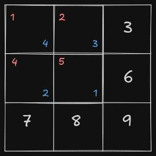
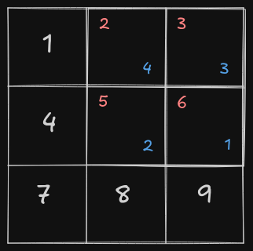
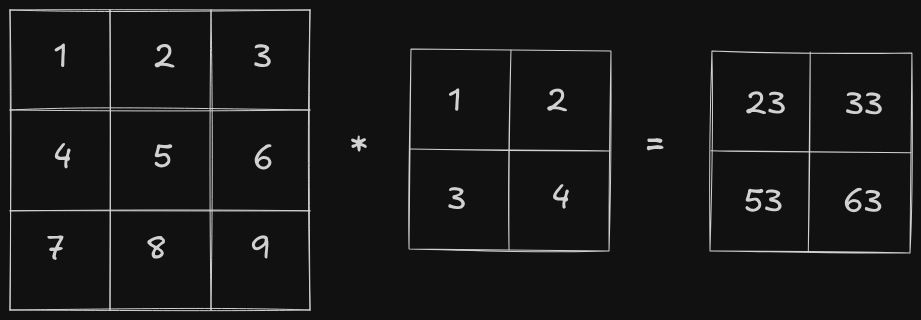
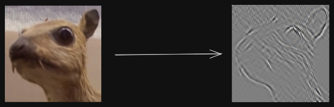
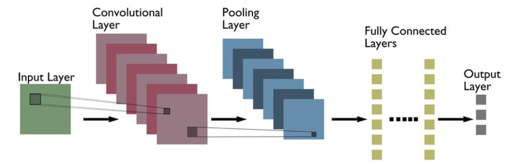
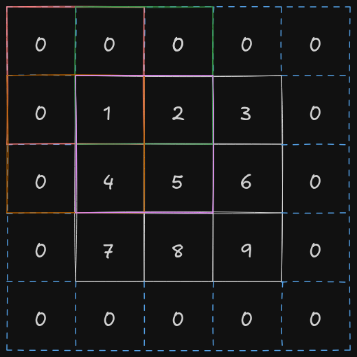
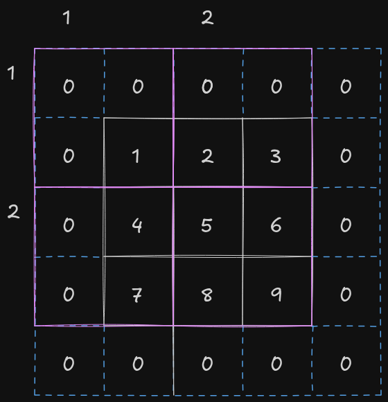
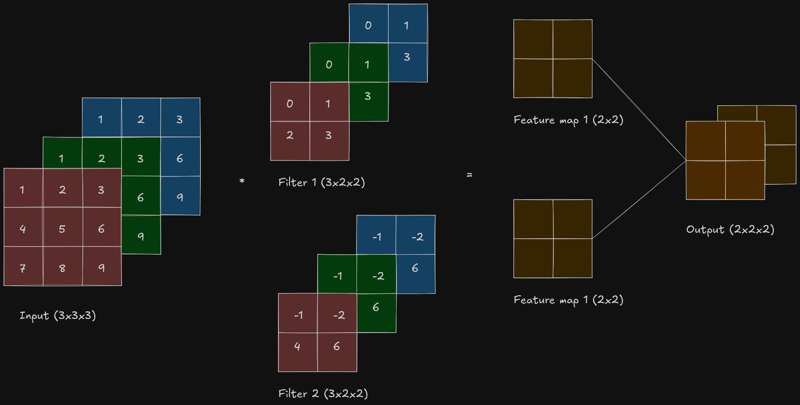
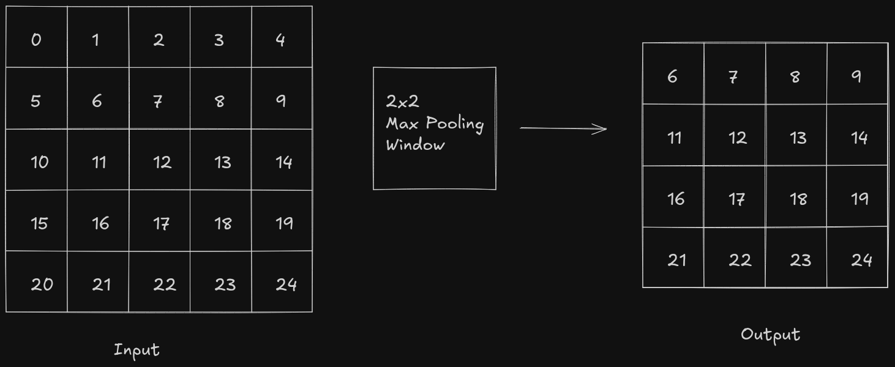

CNNs are a special kind of neural networks that are specifically designed to process data with a grid-like topology, such as images and time-series data. Unlike ANNs, which require the input data to be flattened into a 1D vector, CNNs preserve the spatial structure. The issue with flattening images is that the spatial relationship between the pixels are lost, which leads to poor generalization, a large number of parameters, and an increased risk of over-fitting. CNNs solve this issue by using learnable filters (known as kernels) and the convolution operation.

### **What is convolution?**

Before diving into CNNs, we need to understand what convolution is. If you've ever taken a class related to Fourier transforms in university, then you might have seen this formula:

$$
f(x) * g(x) = \int_{-\infty}^{\infty} f(\tau) * g(x - \tau) \; d\tau
$$

This represents the convolution of two continuous functions, $f(x)$ and $g(x)$. In the context of CNNs, we use the definition of convolution that deals with discrete data. The core intuition of both are essentially the same. The convolution operation measures the overlap between one function and a reversed, shifted version of another. Within that integral, $f(\tau)$ is the function, and $g(x - \tau)$ is the reversed, shifted function. The multiplication between both of them measures "how much they agree with each other" or "how much they overlap with each other.”

Since images are mostly 2D in nature, convolution operations in CNNs are typically applied to matrices. Let's take a look at how it works. Consider two matrices of the shapes 3x3 and 2x2, respectively.


**Note**: Over here `*` denotes convolution operator and not matrix multiplication

In the continuous convolution formula, the second function is reversed before being applied. The matrix equivalent of this reversal is a 180-degree rotation.


After the rotation, the second function is _slid_ across the first function, and the overlap is measured. The matrix equivalent of this is sliding the second matrix across the first matrix and
calculating element-wise multiplication followed by a sum.



The overlapped elements are represented in color (red for the elements of the first matrix and blue for the elements of the second matrix). Here, the result would be calculated as follows:

$$
(1·4)+(2·3)+(4·2)+(5·1)=23
$$



The second matrix slides over all the elements of the first matrix, performing element-wise multiplication followed by a sum. This results in a 2x2 matrix:

$$
(1·4)+(2·3)+(4·2)+(5·1)=23
$$

$$
(2·4)+(3·3)+(5·2)+(6·1)=33
$$

$$
(4·4)+(5·3)+(7·2)+(8·1)=53
$$

$$
(5·4)+(6·3)+(8·2)+(9·1)=63
$$



The first matrix is known as the _"input"_, second matrix is known as the _"kernel/filter"_ and the output is known as the _"feature map"_. The convolution operator is used for _"feature extraction"_ - different kernels, extract different features from the image. For example, on applying the following kernel/filter on an image, the edges are extracted.

$$
\left(
\begin{matrix}
0 & -1 & 0 \\
-1 & 4 & -1 \\
0 & -1 & 0
\end{matrix}
\right)
$$



### Core Ideas of CNN

ANNs show optimal results with tabular data, where the data consist of rows corresponding to examples and columns corresponding to features. However, with tabular data, we lose the spatial structure of the input data. In an image, the pixels close to each other are related, but when the image is fed into an ANN by flattening it, pixels that were initially close to each other might end up far apart.

When writing an algorithm to detect an object in an image, the algorithm should not be overly concerned with the precise location of the object within the image. CNNs exploit the concept of _"spatial invariance"_, which refers to the ability to recognize objects regardless of their position, orientation, or scale within an image.

The earliest layers of the network focus on feature extraction from local regions, which are then aggregated to make predictions at the whole image level. As the network deepens, the later layers capture longer-range features of the image.

## **Architecture of CNN**



### Convolutional Layer

To be honest, convolutional layers are a misnomer because the operation which actually takes place within the convolutional layers is cross-correlation and not convolution. Cross-correlation and convolutional are almost similar but in cross-correlation, the kernel isn't rotated and the rest is the same.

The forward pass within a convolutional layer is pretty straightforward - apply correlation operation between the input and the kernel and add the bias. Let's take a look at the backward pass to get an intuition of how it works.

Consider that the input, kernel and output are represented as follows (ignoring the bias term)

$$
K = \left(
\begin{matrix}
w_1 & w_2 \\
w_3 & w_4
\end{matrix}
\right)
$$

$$
X = \left(
\begin{matrix}
a_1 & a_2 & a_3 \\
a_4 & a_5 & a_6 \\
a_7 & a_8 & a_9
\end{matrix}
\right)
$$

$$
Y = \left(
\begin{matrix}
y_1 & y_2 \\
y_3 & y_4
\end{matrix}
\right)
$$

where,

$$
y_1=a_1w_1+a_2w_2+a_4w_3+a_5w_4
$$

$$
y_2=a_2w_1+a_3w_2+a_5w_3+a_6w_4
$$

$$
y_3=a_4w_1+a_5w_2+a_7w_3+a_8w_4
$$

$$
y_4=a_5w_1+a_6w_2+a_8w_3+a_9w_4
$$

The general formula for backpropagation is represented as follows, where L represents the loss and $\alpha$ is the learning rate.

$$
w^{*}_{i} = w_{i} - \alpha \cdot \frac{dL}{dw_{i}}
$$

The above formula can be represented using matrices as follows

$$
\left(
\begin{matrix}
w^{*}_{1} & w^{*}_{2} \\
w^{*}_{3} & w^{*}_{4}
\end{matrix}
\right)

=

\left(
\begin{matrix}
w_1 & w_2 \\
w_3 & w_4
\end{matrix}
\right)

- \alpha \cdot

\left(
\begin{matrix}
\frac{dL}{dw_1} & \frac{dL}{dw_2} \\ \\
\frac{dL}{dw_3} & \frac{dL}{dw_4}
\end{matrix}
\right)
$$

Using chain rule

$$
\frac{dL}{dw_1} = \frac{dy_1}{dw_1} \cdot \frac{dL}{dy_1} + \frac{dy_2}{dw_1} \cdot \frac{dL}{dy_2} + \frac{dy_3}{dw_1} \cdot \frac{dL}{dy_3} + \frac{dy_4}{dw_1} \cdot \frac{dL}{dy_4}
$$

$$
\frac{dL}{dw_2} = \frac{dy_1}{dw_2} \cdot \frac{dL}{dy_1} + \frac{dy_2}{dw_2} \cdot \frac{dL}{dy_2} + \frac{dy_3}{dw_2} \cdot \frac{dL}{dy_3} + \frac{dy_4}{dw_2} \cdot \frac{dL}{dy_4}
$$

$$
\frac{dL}{dw_3} = \frac{dy_1}{dw_3} \cdot \frac{dL}{dy_1} + \frac{dy_2}{dw_3} \cdot \frac{dL}{dy_2} + \frac{dy_3}{dw_3} \cdot \frac{dL}{dy_3} + \frac{dy_4}{dw_3} \cdot \frac{dL}{dy_4}
$$

$$
\frac{dL}{dw_4} = \frac{dy_1}{dw_4} \cdot \frac{dL}{dy_1} + \frac{dy_2}{dw_4} \cdot \frac{dL}{dy_2} + \frac{dy_3}{dw_4} \cdot \frac{dL}{dy_3} + \frac{dy_4}{dw_4} \cdot \frac{dL}{dy_4}
$$

Using equations of $y_i$, the above differential equations can be simplified down to

$$
\frac{dL}{dw_1} = a_1 \frac{dL}{dy_1} + a_2 \frac{dL}{dy_2} + a_4 \frac{dL}{dy_3} + a_5 \frac{dL}{dy_4}
$$

$$
\frac{dL}{dw_2} = a_2 \frac{dL}{dy_1} + a_3 \frac{dL}{dy_2} + a_5 \frac{dL}{dy_3} + a_6 \frac{dL}{dy_4}
$$

$$
\frac{dL}{dw_3} = a_4 \frac{dL}{dy_1} + a_5 \frac{dL}{dy_2} + a_7 \frac{dL}{dy_3} + a_8 \frac{dL}{dy_4}
$$

$$
\frac{dL}{dw_4} = a_5 \frac{dL}{dy_1} + a_6 \frac{dL}{dy_2} + a_8 \frac{dL}{dy_3} + a_9 \frac{dL}{dy_4}
$$

The following equations can be represented using matrices

$$
\left(
\begin{matrix}
\frac{dL}{dw_1} & \frac{dL}{dw_2} \\ \\
\frac{dL}{dw_3} & \frac{dL}{dw_4}
\end{matrix}
\right)

=

\left(
\begin{matrix}
a_1 & a_2 \\
a_4 & a_5
\end{matrix}
\right) \frac{dL}{dy_1}

+

\left(
\begin{matrix}
a_2 & a_3 \\
a_5 & a_6
\end{matrix}
\right) \frac{dL}{dy_2}

+

\left(
\begin{matrix}
a_4 & a_5 \\
a_7 & a_8
\end{matrix}
\right) \frac{dL}{dy_3}

+

\left(
\begin{matrix}
a_5 & a_6 \\
a_8 & a_9
\end{matrix}
\right) \frac{dL}{dy_4}
$$

The coefficients of each differential term is the subsection of the input matrix where the kernel overlaps, so it is equivalent to finding the correlation between the input matrix and the output gradients.

$$
\boxed{\frac{dL}{dK} = X \; * \;\frac{dL}{dY}}
$$

where `*` denotes cross-correlation operator.

Next up, we need to find $\frac{dL}{dX}$ aka input gradients

1. $a_1$ element is only involved in the cross-correlation operation of $y_1$, so only $y_1$ is dependent of $a_1$

    <br />

   $$
   \frac{dL}{da_1} = \frac{dL}{dy_1} \cdot \frac{dy_1}{da_1} = w_1 \frac{dL}{dy_1}
   $$

   <br />

2. $a_2$ element is involved in the cross-correlation operation of $y_1$ and $y_2$

   <br />

   $$
   \frac{dL}{da_2} = \frac{dL}{dy_1} \cdot \frac{dy_1}{da_2} + \frac{dL}{dy_2} \cdot \frac{dy_2}{da_2} = w_2 \frac{dL}{dy_1} + w_1 \frac{dL}{dy_2}
   $$

   <br />

3. $a_3$ is involved in the cross-correlation operation of only $y_2$

   <br />

   $$
   \frac{dL}{da_3} = \frac{dL}{dy_2} \cdot \frac{dy_2}{da_3} = w_2 \frac{dL}{dy_2}
   $$

   <br />

4. $a_4$ is involved in the cross-correlation operation of $y_1$ and $y_3$

   <br />

   $$
   \frac{dL}{da_4} = \frac{dL}{dy_1} \cdot \frac{dy_1}{da_4} + \frac{dL}{dy_3} \cdot \frac{dy_3}{da_4} = w_3 \frac{dL}{dy_1} + w_1 \frac{dL}{dy_3}
   $$

   <br />

5. $a_5$ is involved in the cross-correlation operation of $y_1$, $y_2$, $y_3$ and $y_4$

   <br />

   $$
   \begin{aligned}
   \frac{dL}{da_5} &= \frac{dL}{dy_1} \cdot \frac{dy_1}{da_5} + \frac{dL}{dy_2} \cdot \frac{dy_2}{da_5} + \frac{dL}{dy_3} \cdot \frac{dy_3}{da_5} + \frac{dL}{dy_4} \cdot \frac{dy_4}{da_5} \\ \\

   &= w_4 \frac{dL}{dy_1} + w_3 \frac{dL}{dy_2} + w_2 \frac{dL}{dy_3} + w_1 \frac{dL}{dy_4}

   \end{aligned}
   $$

   <br />

6. $a_6$ is involved in the cross-correlation operation of $y_2$ and $y_4$

   <br />

   $$
   \frac{dL}{da_6} = \frac{dL}{dy_2} \cdot \frac{dy_2}{da_6} + \frac{dL}{dy_4} \cdot \frac{dy_4}{da_6} = w_4 \frac{dL}{dy_2} + w_2 \frac{dL}{dy_4}
   $$

   <br />

7. $a_7$ is involved in the cross-correlation operation of only $y_3$

   <br />

   $$
   \frac{dL}{da_7} = \frac{dL}{dy_3} \cdot \frac{dy_3}{da_7} = w_3 \frac{dL}{dy_3}
   $$

   <br />

8. $a_8$ is involved in cross-correlation operation of $y_3$ and $y_4$

   <br />

   $$
   \frac{dL}{da_8} = \frac{dL}{dy_3} \cdot \frac{dy_3}{da_8} + \frac{dL}{dy_4} \cdot \frac{dy_4}{da_8} = w_4 \frac{dL}{dy_3} + w_3 \frac{dL}{dy_4}
   $$

   <br />

9. $a_9$ is involved in cross-correlation operation of only $y_4$

   <br />

   $$
   \frac{dL}{da_9} = \frac{dL}{dy_4} \cdot \frac{dy_4}{da_9} = w_4 \frac{dL}{dy_4}
   $$

   <br />

If you notice all of the above equations closely then you’d notice that all the equations could be generalized using full convolution operation.

$$
\boxed{\frac{dL}{dX} = \frac{dL}{dY} \otimes K}
$$

where $\otimes$ denotes full convolution operator.

```python
import torch
from scipy import signal
from typing import Tuple

def corr2d(x: torch.Tensor, y: torch.Tensor) -> torch.Tensor:
    return torch.Tensor(signal.correlate2d(x.data, y.data, mode="valid"))

def conv2d(x: torch.Tensor, y: torch.Tensor) -> torch.Tensor:
    return torch.Tensor(signal.convolve2d(x.data, y.data, mode="full"))

class ConvLayer:
    def __init__(self, input_shape: Tuple[int, int], kernel_size: int) -> None:
        input_height, input_width = input_shape
        output_shape = (input_height - kernel_size + 1, input_width - kernel_size + 1)
        self.kernel = torch.randn((kernel_size, kernel_size), requires_grad=False)
        self.bias = torch.zeros(1, requires_grad=False)

    def forward(self, input) -> torch.Tensor:
        self.input = input
        return corr2d(input, self.kernel) + self.bias

    def backward(self, output_gradients, lr) -> torch.Tensor:
        kernel_gradients = corr2d(self.input, output_gradients)
        input_gradients = conv2d(output_gradients, self.kernel)

        self.kernel -= lr * kernel_gradients
        self.bias -= lr * output_gradients.sum()

        return input_gradients
```

### Padding

There is an issue with the current implementation of the convolutional layer. If we apply the cross-correlation operation right now, we might lose information about the pixels in the corners, as they are involved in only one of the cross-correlation operations. To fix this issue, the entire input matrix is padded with additional rows and columns so that corner pixels get included more often and their information is retained.

By adding an extra row row and extra column on both the sides, the top-left corner pixel is now involved in 4 different cross-correlation operation.



In PyTorch, a tensor could you padded by using [`torch.nn.functional.pad`](https://docs.pytorch.org/docs/stable/generated/torch.nn.functional.pad.html) function

```python
import torch
import torch.nn.functional as F

X = torch.Tensor([
    [1, 2, 3],
    [4, 5, 6],
    [7, 8, 9]
])

# (1, 1, 1, 1) = (left, right, top, bottom)
# mode = "constant", adds 0 in the padded regions
padded_X = F.pad(X, (1, 1, 1, 1), mode="constant")

print(padded_X.data)
```

### Stride

Stride indicates the number of rows and columns traversed per slide of the kernel. Sometimes, especially when the kernel is large in size, we would like to skip the intermediate and slide more than one element at once.



The above figure shows the movement of kernel on a input matrix of shape 3x3 with a padding of (1, 1, 1, 1) and stride equal to (2, 2).

The output shape when input matrix of shape $(n_h, \; n_w)$ with a total padding equal to $(p_h, \; p_w)$ and stride equal to $(s_h, \; s_w)$, and kernel of shape $(k_h, \; k_w)$ are passed to convolutional layer

$$
\left(
\lfloor
\frac{n_h - k_h + p_h + s_h}{s_h}
\rfloor

,

\lfloor
\frac{n_w - k_w + p_w + s_w}{s_w}
\rfloor
\right)
$$

### Multiple Input Channels

Until now, we have only gone through the case where the image has only 1 channel. Let’s take a look at how the convolutional layer processes the input image when it has more than 1 channel.

Most of the images have 3 channels - one for red, green and blue respectively, so the shape of the image can be represented as $3 \times h \times w$, where $h$ is the height of the image and $w$ is the width of the image.

When the input data contains more than 1 channels, the kernel must be constructed with the same number of channels as the input data, so that it can perform cross-correlation with the entire input data. If shape of the kernel is $k_h \times k_w$ and the number of channels of the input data is $c_i$ then there must be a $k_h \times k_w$ kernel for every input channel, concatenating all of them together gives a kernel of shape $c_i \times k_h \times k_w$.

The convolutional layer performs cross-correlation operation on the two-dimensional tensor of the input data and the two-dimensional tensor of the kernel for each channel and summing all of the results together to return a two-dimensional tensor as the output.


```python
import torch
from scipy import signal

def corr2d(x: torch.Tensor, y: torch.Tensor) -> torch.Tensor:
    return torch.Tensor(signal.correlate2d(x.data, y.data, mode="valid"))

def corr2d_multi(x: torch.Tensor, y: torch.Tensor) -> torch.Tensor:
    return sum(corr2d(p, q) for p, q in zip(x, y))

X = torch.Tensor([
    [
        [1, 2, 3],
        [4, 5, 6],
        [7, 8, 9]
    ],
    [
        [1, 2, 3],
        [4, 5, 6],
        [7, 8, 9]
    ],
    [
        [1, 2, 3],
        [4, 5, 6],
        [7, 8, 9]
    ]
])

k = torch.Tensor([
    [
        [0, 1],
        [2, 3]
    ],
    [
        [0, 1],
        [2, 3]
    ],
    [
        [0, 1],
        [2, 3]
    ]
])

print(corr2d_multi(X, k).data)
```

### Multiple Output Channels

Regardless the number of input channels, so far we always end up with one output channel. The issue with having just one output layer is that the network would be forced to compress all of the meaningful features from the input into a single representation, which is extremely limiting.

In the most popular neural network architectures, we actually increase the channel dimension as we go deeper in the neural network, where a single output channel can only one kind of feature per spatial location.

If $c_i$ and $c_o$ are the number of input and output channels respectively then to get an output with multiple channels, a cross-correlation operation should be done for every output channel with a kernel of shape $c_i \times k_h \times k_w$ . The results of all the cross-correlation are concatenated on the output channel dimension, so the shape of the kernel is $c_o \times c_i \times k_h \times k_w$ - there are $c_o$ number of kernels with $c_i$ number of channels and of shape $k_h \times k_w$.



```python
import torch
from scipy import signal

def corr2d(x: torch.Tensor, y: torch.Tensor) -> torch.Tensor:
    return torch.Tensor(signal.correlate2d(x.data, y.data, mode="valid"))

def corr2d_multi_in(x: torch.Tensor, y: torch.Tensor) -> torch.Tensor:
    return sum(corr2d(p, q) for p, q in zip(x, y))

def corr2d_multi_in_out(x: torch.Tensor, y: torch.Tensor) -> torch.Tensor:
    return torch.stack([corr2d_multi_in(x, k) for k in y], 0)
```

### Pooling Layer

Pooling layer is applied after a convolutional layer to down sample the feature map, but what is the need to down sample the feature map?

If a model is just stacked up with convolutional layers then the model learns “where exactly are the features are present”, due to which the model would only be able to detect the features if they are present in a specific region. For a CNN, we want it to be locally invariant i.e. slight change within a local region of the input should not affect the output of the model much. By using pooling layers, the model learns “whether that the feature exists”, not where exactly. This helps in generalization and controls overfitting.

Pooling layer also solves the issue with large spatial dimensions. Consider that a single RGB image of size 228x228 is passed into the convolutional layer which has 100 filters and each of size 3x3, so the size of the output would be 226x226x100. Consider that 32-bit floating integer was used to store the values of the pixel so in total 226x226x100x32 bits would be required to store the feature map, which is almost 20 MB and this is just for one single image.

Pooling layer as a window-like operation where a window slides over another matrices, according to its stride, and performs some operation. Pooling layer doesn’t have any parameters, as compared to convolutional layer, so pooling layer is deterministic.

There are mainly two types of pooling operations which are commonly used - max pooling and average pooling.

In case of average pooling, the pooling window slides over the feature map and calculates the average of all the pixel values in that region.


In case of max pooling, the pooling window slides over the feature map, starting from the upper-left corner of the feature map, and calculates the maximum pixel value in that region. In max pooling, the dominant features are retained and it is resistant to background noise but it is pretty sensitive to outliers.



```python
import torch

def pooling_layer(x: torch.Tensor, pool_size: int, mode: str) -> torch.Tensor:
    p_h, p_w = pool_size
    y = torch.zeros((x.shape[0] - p_h + 1, x.shape[0] - p_w + 1))

    for i in range(y.shape[0]):
        for j in range(y.shape[1]):
            if mode == "max":
                y[i, j] = x[i: i + p_h, j: j + p_w].max()
            elif mode == "avg":
                y[i, j] = x[i: i + p_h, j : j + p_w].mean()

    return y
```

In each of multiple channels, the pooling operation is applied on each channel and at the end all the layers are concatenated

## LeNet

As we have gone through almost all the basics of CNN, let's try to implement LeNet (specifically LeNet-5) using PyTorch. LeNet was one of the first CNNs which captured wide attention for its performance in computer vision tasks. It was introduced in the paper named “[**Convolutional Networks for Images, Speech, and Time-Series**](https://www.researchgate.net/publication/216792820_Convolutional_Networks_for_Images_Speech_and_Time-Series)”.


LeNet-5 comprises of two parts - feature extractor which contains two convolutional blocks and a classifier which contains a dense block of fully connected linear layers.

**Note**: ReLU and max pooling show better results as compared to using sigmoid and average pooling but they weren’t discovered until that point.

Let’s go through the architecture and understand what layer does

1. A grayscale 28x28 image is passed into the network
2. It goes through a convolutional layer which has a kernel of size 5x5 and padding equal to 2 and it produces feature map of size 28x28 with 6 channels
3. Sigmoid activation function is applied on the feature maps
4. The feature maps then go through an average pooling layer which down sample the feature maps from 28x28 to 14x14
5. The down sampled feature maps go through another convolutional layer which has a kernel of size 10x10 and it produces feature map of size 10x10 with 16 channels
6. Sigmoid activation function is applied on the feature maps
7. The feature maps then go through another average pooling layer which down sample the feature maps from 10x10 to 5x5
8. The 5x5 feature maps with 16 channels are flattened, which gives a 1D vector of size 400
9. The flattened 1D vector is then passed into a series of fully connected layers which uses sigmoid as the activation function

Using PyTorch’s [`nn.Sequential`](https://docs.pytorch.org/docs/stable/generated/torch.nn.Sequential.html) API, we can easily implement the model’s architecture

```python
import torch
import torch.nn as nn

class LeNet(nn.Module):
    def __init__(self):
        super(LeNet, self).__init__()

        self.model = nn.Sequential(
            nn.Conv2d(1, 6, kernel_size=5, padding=2),
            nn.Sigmoid(),
            nn.AvgPool2d(kernel_size=2, stride=2), # 6@28x28 -> 6@14x14
            nn.Conv2d(6, 16, kernel_size=5), # 6@14x14 -> 16@10x10
            nn.Sigmoid(),
            nn.AvgPool2d(kernel_size=2, stride=2), # 16@10x10 -> 16@5x5
            nn.Flatten(), # 16 * 5 * 5 = 400
            nn.Linear(16 * 5 * 5, 120),
            nn.Sigmoid(),
            nn.Linear(120, 84),
            nn.Sigmoid(),
            nn.Linear(84, 10)
        )

    def forward(self, x: torch.Tensor) -> torch.Tensor:
        return self.model(x)
```

Let’s train the model on MNIST dataset and test it out. Let’s start with adding some basic data transforms and dataset loaders, with a batch size of 32.

```python
device = torch.device("cuda" if torch.cuda.is_available() else "cpu")

train_data_transform = transforms.Compose([
    transforms.ToTensor(),
    transforms.Normalize(mean=[0.5], std=[0.5]),
])
test_data_transform = transforms.Compose([
    transforms.ToTensor(),
    transforms.Normalize(mean=[.5], std=[.5])
])

train_dataset = datasets.MNIST(root="data", train=True, transform=train_data_transform, download=True)
test_dataset = datasets.MNIST(root="data", train=False, transform=test_data_transform, download=True)

train_loader = utils.data.DataLoader(train_dataset, batch_size=32, shuffle=True)
test_loader = utils.data.DataLoader(test_dataset, batch_size=32, shuffle=False)
```

For loss function, cross entropy is chosen as the output of our model (which of shape `[32, 10]`) returns the class indices of the predicated digits and it isn’t one-hot encoded so cross entropy is a better choice over BCELogits. For optimizer, adam is used with a learning rate of `0.001`

```python
model = LeNet().to(device=device)
loss_function = nn.CrossEntropyLoss()
optimizer = optim.Adam(model.parameters(), lr=0.001)
```

The model is trained over 7 epochs and after each epoch test loss and test accuracy is calculated. After running it on my machine, the final test loss was 0.0504 with an accuracy of 98.41%

```python
NUM_EPOCHS = 7

model.train()

for epoch in range(NUM_EPOCHS):
    running_loss = 0.0

    for i, (inputs, targets) in enumerate(train_loader):
        inputs = inputs.to(device)
        targets = targets.to(device)

        optimizer.zero_grad()
        outputs = model(inputs)
        loss = loss_function(outputs, targets)

        loss.backward()
        optimizer.step()

        running_loss += loss.item()

        if i % 100 == 99:
             print(f"[epoch {epoch + 1}, batch {i + 1}] loss: {running_loss / 100:.3f}")
             running_loss = 0.0

    model.eval()
    test_loss = 0.0
    correct = 0
    total = 0

    with torch.no_grad():
        for inputs, targets in test_loader:
            inputs = inputs.to(device)
            targets = targets.to(device)

            outputs = model(inputs)
            loss = loss_function(outputs, targets)

            test_loss += loss

            _, predicated = torch.max(outputs, 1)
            correct += (predicated == targets).sum().item()
            total += targets.size(0)

    accuracy = 100 * correct / total
    print(f"test loss: {test_loss / len(test_loader):.4f}, acc: {accuracy:.2f}%\n")
```

If sigmoid is replaced with ReLU, then the final test loss is 0.0308 with an accuracy of 99.01%. As `nn.CrossEntropyLoss` is used as the loss function, there is no need to add additional softmax layer at the end as `nn.CrossEntropyLoss` does it under the hood.

```python
class LeNet(nn.Module):
    def __init__(self):
        super(LeNet, self).__init__()

        self.model = nn.Sequential(
            nn.Conv2d(1, 6, kernel_size=5, padding=2),
            nn.ReLU(),
            nn.AvgPool2d(kernel_size=2, stride=2), # 6@28x28 -> 6@14x14
            nn.Conv2d(6, 16, kernel_size=5), # 6@14x14 -> 16@10x10
            nn.ReLU(),
            nn.AvgPool2d(kernel_size=2, stride=2), # 16@10x10 -> 16@5x5
            nn.Flatten(), # 16 * 5 * 5 = 400
            nn.Linear(16 * 5 * 5, 120),
            nn.ReLU(),
            nn.Linear(120, 84),
            nn.ReLU(),
            nn.Linear(84, 10)
        )

    def forward(self, x: torch.Tensor) -> torch.Tensor:
        return self.model(x)
```

Well, that’s it for this blog. I’ve tried to cover almost all the basics related to CNNs while trying to keep the explanation simple and easy-to-understand. The final implementation of LeNet can be obviously more optimized by adding some padding, using batch normalization and using max pooling instead of average pooling. I might go through the modern CNNs like VGG and ResNet in some other blog post.
