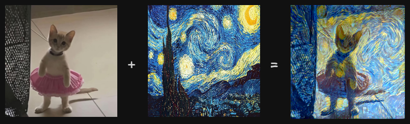
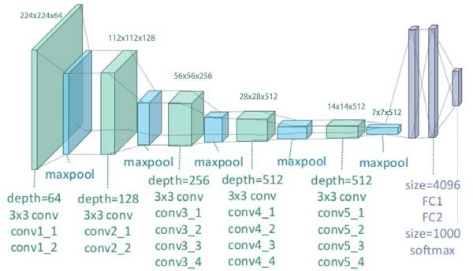

Hey there! In this blog post, we will explore how to extract the art style from an image of a painting and then apply it to another image, generating a new image that retains the content of the original but utilizes the art style of the painting. If you are not familiar with CNNs, I would highly recommend you to check out my other blogs on CNNs — [CNNs Explained](../blogs/cnns-explained.md) and [Exploring different CNNs](../blogs/exploring-different-cnns.md).



In the above image, a silly cat picture is combined with “[The Starry Night](https://en.wikipedia.org/wiki/The_Starry_Night)” painting, resulting in a silly cat picture with a blue-ish tint everywhere and swirls, similar to those present in the Starry Night painting. The final output does look kinda scary tho.

## What is Neural Style Transfer?

Neural Style Transfer (NST) is a computer vision technique that utilizes deep neural networks to combine the content of one image with the style of another, resulting in a new image that resembles the first image painted in the style of the second image. In this blog post, we will go through the paper titled “[Image Style Transfer Using Convolutional Neural Networks](https://www.cv-foundation.org/openaccess/content_cvpr_2016/papers/Gatys_Image_Style_Transfer_CVPR_2016_paper.pdf)” which leverages the layer-wise representation of CNN to extract content and style from the image and then combine them.

CNNs consist of layers of small computational units (aka convolutional layers) that process the visual information hierarchically in a feed-forward manner, and each layer consists of a collection of image filters, each of which extracts a certain feature from the input image and the output of these layers is a “differently filtered” version of the input image. The representation of the image at the final layers cares more about the “content” of the image compared to its pixel values.

In neural style transfer, a pre-trained convolutional neural network (such as VGG19) is used to extract features from three images — the content image (the original photo), the style image (the artistic reference), and the generated image (which is randomly initialized at first). During each iteration, the network performs a forward pass on all three images, and features are extracted from specific layers to capture both content and style.

For extracting the content, outputs from the deeper layers are used, as these layers capture high-level information while discarding the fine pixel-level details. For extracting the style, we look at how different filters in the network respond together. Instead of using the filters directly, we use the correlations between them across the whole image. These correlations help describe the texture of the image. By doing this across several layers of the network, we get a multi-level summary of the image’s texture, without focusing on the exact layout of objects.

## Workflow

A pre-trained VGG-19 network is used, without the fully-connected layers at the end, as we only need the convolutional layers to extract the different features from content and style image. Initially, the content image is feed into the network and the outputs of `conv4_2` layer are stored. Within the paper, `conv4_2` is used as the content extractor — the layer which outputs the high-level representation of the image without focusing much on the pixel-level details.

Similarly, the style image is also feed into the network but for extracting style features, outputs from various convolutional layers are stored. The outputs of `conv1_1`, `conv2_1`, `conv3_1`, `conv4_1` and `conv5_1` are used to extract the style features.



The network doesn’t perform backpropagation for the content and style image. We are not training the network, we are using CNN to extract the features as it is the most optimal algorithm for image processing and replicates how the human eye works.

The paper suggests to randomly initialize the “synthesized/combination” image tensor but from the tests which I carried out, it is better to initialize the synthesized image tensor to be equal to the content image.

In each iteration, the synthesized image is fed into the network and then loss is calculated. The loss measures the “amount of difference” in terms of the content present in the synthesized image and the content image and also it measures the “amount of difference” in terms of the art style present in the synthesized image and the style image. We will take a deeper look at these cost functions in the next section. The network performs backpropagation and updates the synthesized image and tries to reduce the aforementioned loss.

## Loss functions

$$
\mathcal{L}(\vec{p}, \vec{a}, \vec{x}) = \alpha \mathcal{L}_{\text{content}} (\vec{p}, \vec{x}) + \beta \mathcal{L}_{\text{style}} (\vec{a}, \vec{x})
$$

The above equation represents the loss function which is utilized by the network, where $\vec{p}$ represents the content image (i.e. original image), $\vec{a}$ represents the style image and $\vec{x}$ represents the generated image. The loss function consists of two parts — content loss and style loss, which are multiplied by some hyper parameters — $\alpha$, $\beta$, which act as the weights for the content and style losses.

### Content loss function

$$
\mathcal{L}_{\text{content}} (\vec{p}, \vec{x}, l) = \frac{1}{2} \sum_{i=1}^{N_l} \sum_{j=1}^{M_l} (F^{l}_{i,j} - P^{l}_{i,j})^{2}
$$

The content loss function is basically mean squared error (MSE) — it calculates the mean over square of difference of each corresponding pixel in $F^{l} \in \R^{N_l \times M_l}$ and $P^{l} \in \R^{N_l \times M_l}$, which are the feature representations of the generated image and original image respectively on layer $l$. $N_l$ is the number of feature maps in the layer $l$ and $M_l$ is equal to height times width of that feature map.

### Style loss function

$$
\mathcal{L}_{\text{style}} = \sum_{l} w_{l} \mathcal{L}^{l}_{\text{style}} \\ \\
\mathcal{L}^{l}_{\text{style}} = \frac{1}{4N_l^{2}M_l^{2}} \sum_{i = 1}^{N_l} \sum_{j = 1}^{M_l} (G^{l}_{i,j} - A^{l}_{i,j})^{2} \\ \\
G^{l}_{i,j} = \sum_{k = 1}^{M_l} F^{l}_{ik} F^{l}_{kj}


$$

There is quite a lot going on over here — let’s break it down.

$G^{l}$ represents the gram matrix of feature representations of the generated image at layer $l$. What is a gram matrix? Gram matrix calculates the co-relation between different filter maps to see how “similar” different features are to each other. The actual mathematics behind it involves kernel functions and maximum mean discrepancy (MMD). If you are interested in diving into the actual mathematics behind it, I would recommend you to read the paper titled “[Demystifying Neural Style Transfer](https://arxiv.org/pdf/1701.01036)”, which discusses about how exactly are gram matrices able to represent the artistic style in an image?

$A_l$ also represents a gram matrix but it is calculated on the feature representations of the style image at layer $l$.

$\mathcal{L}_{\text{style}}^{l}$ represents the style loss for layer $l$ — it is quite similar to MSE but instead of having 0.5 as the coefficient in front $0.25N_l^{2}M_l^{2}$ is used.

$\mathcal{L}_{\text{style}}$
represents the total style loss, which is basically sum of all the style losses of each individual layer multiplied with their corresponding weights ($w_l$).

## Implementation

Let’s start with creating a `NST` class which uses pre-trained VGG19 and returns the outputs of `conv4_2` layer for extracting content and outputs of `conv1_1`, `conv2_1`, `conv3_1`, `conv4_1` and `conv5_1` layers for extracting style.

```python
class NST(nn.Module):
    def __init__(self):
        super().__init__()

        self.content_layers = ["21"] # conv4_2
        self.style_layers = ["0", "5", "10", "19", "28"] # conv1_1, conv2_1, conv3_1, conv4_1, conv5_1
        self.model = models.vgg19(weights="DEFAULT").features[:29] # type: ignore

    def forward(self, x):
        content_features = []
        style_features = []

        for i, layer in enumerate(self.model):
            x = layer(x)

            if (str(i) in self.content_layers):
                content_features.append(x)

            if (str(i) in self.style_layers):
                style_features.append(x)

        return content_features, style_features
```

Let's write a small utility function that opens an image, that exists at a specific path, applies a transform on it, and returns the final modified version.

```python
def load_image(path, device, transform):
    img = Image.open(path)
    img = transform(img).unsqueeze(0) # add batch dimension
    img = img.to(device)
    return img
```

The transform is quite simple — it just resizes the image into 224x224 (size of an image in ImageNet dataset) and converts it into a tensor. The synthesized/generated image is initialized to be equal to content image, as it reaches the optimal minima quicker via that approach (according to the experiments which I have carried out).

```python
device = torch.device("cuda" if torch.cuda.is_available() else "cpu")
transform = transforms.Compose([
    transforms.Resize((224, 224)),
    transforms.ToTensor()
])

content_img_path = "/content/images/content.jpg"
style_img_path = "/content/images/style.jpg"

content_img = load_image(content_img_path, device, transform)
style_img = load_image(style_img_path, device, transform)
generated_img = content_img.clone().requires_grad_(True)
```

The model is set to be in evaluation mode as we are not updating the weights of the network. I have set the $\alpha$ (content loss weight) to be equal to 1 and $\beta$ (style loss weight) to be equal to 0.01. To the optimizer, only `generated_img` is passed in, as that’s the thing which we want to update in each iteration.

```python
total_steps = 6000
learning_rate = 0.001
alpha = 1
beta = 0.01

model = NST().to(device).eval()
optimizer = torch.optim.Adam([generated_img], learning_rate)
```

The content and style features are extracted from the content and style image respectively, without any backpropagation.

```python
with torch.no_grad():
  content_features, _ = model(content_img)
  _, style_features = model(style_img)
```

At the start of each iteration, content and style features are extracted from the generated image. Before calculating the loss, the features are converted into shape of `[C, H * W]`.

Calculating the content loss is quite simple as it is basically MSE — finding the mean of square of the difference of content feature from the generated image and the actual content features.

For calculating the style loss, we have to first calculate the gram matrices for the feature representations of the generated image and also for the style image.

$$
G^{l}_{i,j} = \sum_{k = 1}^{M_l} F^{l}_{ik} F^{l}_{kj}
$$

For the above expression, it is evident that calculating gram matrix basically involves finding the product of a matrix with its transpose. After the gram matrices are calculated, the style loss would be equal to the MSE of those two gram matrices. The additional coefficients can be learned by the style loss weight ($\beta$).

```python
for step in range(total_steps):
    generated_content_features, generated_style_features = model(generated_img)

    content_loss = torch.tensor(0.0, device=device)
    style_loss = torch.tensor(0.0, device=device)

    for content_feature, gen_content_feature in zip(content_features, generated_content_features):
      _, channel = gen_content_feature.shape
      gen_content_feature = gen_content_feature.view(channel, -1)
      content_feature = content_feature.view(channel, -1)

      content_loss += torch.mean((gen_content_feature - content_feature) ** 2)

    for style_feature, gen_style_feature in zip(style_features, generated_style_features):
      _, channel, height, width = gen_style_feature.shape
      gen_style_feature = gen_style_feature.view(channel, -1)
      style_feature = style_feature.view(channel, -1)

      G = gen_style_feature @ gen_style_feature.T
      A = style_feature @ style_feature.T
      style_loss += torch.mean((G - A) ** 2)

    total_loss = alpha * content_loss + beta * style_loss
    optimizer.zero_grad()
    total_loss.backward()
    optimizer.step()

    if step % 200 == 0:
        print(total_loss)
        utils.save_image(generated_img, f"/content/outputs/{step}.png")
```

## Wrapping up

Well, that’s it for this blog post — it is quite small but it focuses on showing that CNNs can be used for different tasks other than the traditional classification and regression problems. If you want to check out the entire code, here’s the GitHub repository link — https://github.com/0xMukesh/neural-style-transfer.

## References

1. [Image Style Transfer Using Convolutional Neural Networks](https://www.cv-foundation.org/openaccess/content_cvpr_2016/papers/Gatys_Image_Style_Transfer_CVPR_2016_paper.pdf)
2. [A Neural Algorithm of Artistic Style](https://arxiv.org/pdf/1508.06576)
3. [Demystifying Neural Style Transfer](https://arxiv.org/pdf/1701.01036)
