Hey there! In this blog post we are going to explore different CNNs and see how did they evolve from the foundational LeNet to much more complex networks like Inception, ResNet and ResNeXt,

## AlexNet

AlexNet was introduced in the paper [Image Classification with Deep Convolutional Neural Networks](https://proceedings.neurips.cc/paper_files/paper/2012/file/c399862d3b9d6b76c8436e924a68c45b-Paper.pdf), and won 2012 ImageNet challenge by a huge margin. The first foundational CNN, LeNet, was introduced in the year 1995, but CNNs didn’t get picked up that fast by the computer vision community just after that.

LeNet achieved good results on small datasets but the performance and feasibility of training CNNs on larger datasets had yet to be established. The major bottleneck was compute power, the CPUs which were available around 1995 didn’t have enough compute power to apply CNNs in large scale i.e. on high resolution images.

AlexNet is sorta-like a precursor to LeNet, but with quite a few optimizations and changes:

1. AlexNet used a non-saturating activation function like ReLU instead of saturating activation functions like sigmoid and tanh to optimize the training process.
2. AlexNet utilized cross-GPU parallelization. It used two GTX 580 GPUs and each GPU handled half of the model’s kernels. There was an advantage with using that specific version of GPU as it allowed to read from and write to one another GPU’s memory directly, without going through another host machine. To reduce the communication overhead between the two GPUs, the communication between the two GPUs only happened in a certain layers of the network.
3. AlexNet introduced Local Response Normalization or LRN, which was used after ReLU activation function in a few layers, to improve the generalization of the network.

   $$
   b^{i}_{x,y} = \frac{a^{i}_{x,y}}{\left ({k + \alpha \sum^{\text{max}(N-1, i + n/2)}_{\text{min}(0, i - n/2)} (a^{j}_{x,y})^{2}} \right )^{\beta}}
   $$

   The main idea of LRN is to boost neurons with strong activations while suppressing the nearby neurons with lower activations. It is very similar to the biological idea called [lateral inhibition](https://en.wikipedia.org/wiki/Lateral_inhibition), which is the capacity of an excited neuron to reduce the activity of its neighboring neurons.

   LRN goes through each neuron present in each feature map of the output, in such a way that it goes through all the neurons present at $(x, y)$ position in all the adjacent $n$ feature maps and _boosts_ the neuron with strong activation and suppresses the others in those adjacent $n$ feature maps.

   According to the AlexNet paper, the values of $n, \; k, \; \alpha, \; \beta$ where were used are $k = 2, \; n = 5, \; \alpha = 10^{-4} , \; \beta = 0.75$.

4. Overlapping pooling layers were used in AlexNet — the stride is less than the kernel size in the pooling layer.

### Architecture

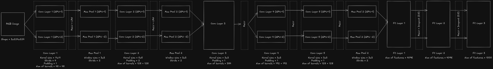

The above image shows the complete end-to-end architecture of AlexNet, which contains 5 convolutional layers and 3 fully-connected layers. Let’s break it down into simple chunks.

1. A RGB image of size 224x224 is taken as an input to the network.
2. The image is passed into a convolutional layer whose kernels are split across two different GPUs.
3. The feature maps of each individual GPU are normalized and sent to a pooling layer, which is again processed on the individual GPU.
4. The normalized and pooled output of the first convolutional layer is then passed into the second convolutional layer, whose kernels are also split across two different GPUs.
5. At the third convolutional layer, GPU-to-GPU communication takes place i.e. all the kernels are _merged_ and not split across two different GPUs.
6. The fourth and fifth convolutional layers’ kernels are again split across two different GPUs and processed individually.
7. At the start of the fully connected layer series, the outputs from the different GPUs are _merged_ and the results of each fully connected layer are not processed across different GPUs i.e. GPU-to-GPU communication takes place in between each fully-connected layer.
8. The fully connected layer series has a few dropout layers in between, which helps in preventing overfitting.

### Implementation

```python
from torch import nn

class AlexNet(nn.Module):
    def __init__(self):
        super().__init__()

        self.model = nn.Sequential(
            nn.Conv2d(in_channels=3, out_channels=96, kernel_size=11, stride=4, padding=1),
            nn.ReLU(),
            nn.LocalResponseNorm(size=5, alpha=1e-4, k=2, beta=0.75),
            nn.MaxPool2d(kernel_size=3, stride=2),

            nn.Conv2d(in_channels=96, out_channels=256, kernel_size=5, padding=2),
            nn.ReLU(),
            nn.LocalResponseNorm(size=5, alpha=1e-4, k=2, beta=0.75),
            nn.MaxPool2d(kernel_size=3, stride=2),

            nn.Conv2d(in_channels=256, out_channels=384, kernel_size=3, padding=1),
            nn.ReLU(),

            nn.Conv2d(in_channels=384, out_channels=384, kernel_size=3, padding=1),
            nn.ReLU(),

            nn.Conv2d(in_channels=384, out_channels=256, kernel_size=3, padding=1),
            nn.ReLU(),
            nn.MaxPool2d(kernel_size=3, stride=2),

            nn.Flatten(),

            nn.LazyLinear(out_features=4096),
            nn.ReLU(),
            nn.Dropout(0.5),

            nn.Linear(in_features=4096, out_features=4096),
            nn.ReLU(),
            nn.Dropout(0.5),

            nn.Linear(in_features=4096, out_features=1000)
        )

    def forward(self, x):
        x = self.model(x)
        return x
```

## VGGNet

VGGNet was introduced in the paper [Very Deep Convolutional Networks For Large-Scale Image Recognition](https://arxiv.org/pdf/1409.1556), and won 2014 ImageNet challenge. Around this time, the researchers have moved from thinking about individual neuron to layers and now to blocks — repeating patterns of layers. VGGNet was the first CNN which proposed this idea of using “blocks”.

The common pattern in CNNs until now was convolutional layer → ReLU + normalization layer → pooling layer but this reduces the spatial dimension of the image rapidly. In case of ImageNet dataset which contains images of size 224x224, then within 8 layers it would reach a size of 1x1 i.e. all the dimensions would have been used up until that point.

VGGNet majorly focused on the “depth” of the network i.e. how the network performs as its depth increases and it used multiple convolutional layers before using a pooling layer to down-sample the feature maps. In VGGNet, mostly 3x3 kernels are used in the convolutional layers and the reason behind is related to receptive fields and performance.

### Receptive field

The receptive field of a particular neuron in a particular layer of a CNN is the region of input image which the neuron is “_able to see_” i.e. which affects the activation of that neuron. Consider two convolutional layers with kernel size of 3x3, padding of 1 and stride of 1, which are applied to a 6x6 input image. The size of the final image is 6x6. The value of each neuron in the final image is dependent on a window of size 3x3 on the previous layer but each neuron in that layer is again dependent on a window of size 3x3 on the input layer i.e. each neuron in the final image sees the input image through a window of size 5x5. The receptive field of that neuron becomes 5x5 and the receptive field keeps increasing for the neurons in the deeper layers of the network.

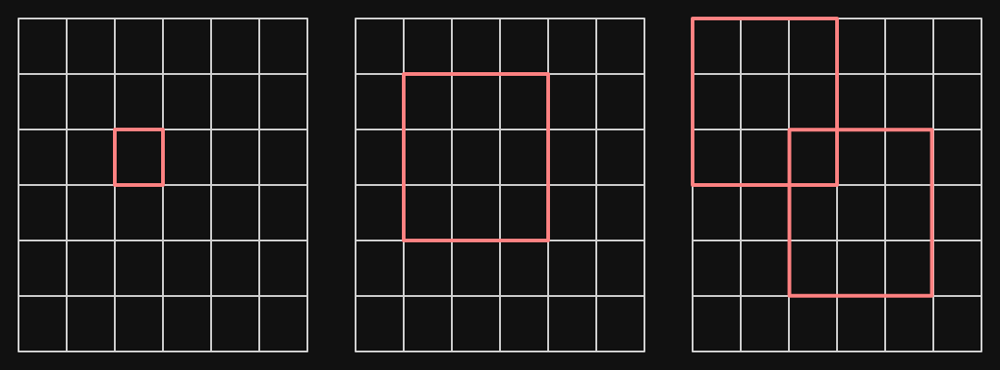

Instead of using two convolutional layers each with 3x3 kernel, we could have used a single 5x5 kernel and the neuron would still have the same receptive field.

Consider that an image with $c_1$ channels is passed into a convolutional layer which outputs a feature map with $c_2$ channels. The convolutional layer has 5x5 kernels each with $c_1$ number of channels. The number of parameters required for it would be $25c_1c_2$. In case of two successive convolutional layers each with 3x3 kernels which does the same thing as above, it requires $2 \cdot 9c_1c_2 = 18c_1c_2$ parameters. The number of parameters which are required for the two successive 3x3 convolutional layers are far lower and each neuron in the output feature map has the same receptive field as a single 5x5 convolutional layer. Due to this, stacking 3x3 convolutional layers became common in deep CNNs.

### Architecture

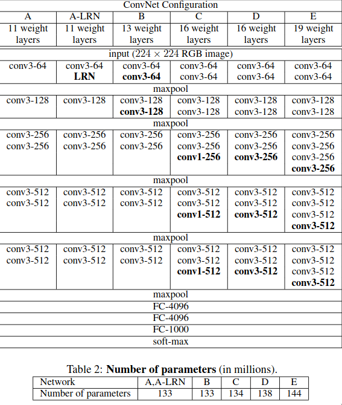

The VGGNet paper had 6 different architectures/convnet configurations, which are just slight variations of the previous ones. Let’s go through a few of the major differences between VGG and AlexNet:

1. In AlexNet, the first convolutional layer had a kernel of size 11x11 but in VGG, a small kernel of size 3x3 is used and those layers are stacked on top of each other to get the same receptive field but with lesser number of parameters and more number of non-linear activation function can be added in between these convolutional layers instead of just one.
2. Usage of 1x1 convolutional layer, which allows to adds non-linearity without changing the size of the receptive field. A trainable non-linearity block generally consists of a convolutional layer + ReLU but if the kernel’s shape isn’t 1x1 then the size of the receptive field changes. 1x1 convolutional layer was first used in the paper of “Network in Network”
3. Except for one network (VGGNet A-LRN), the rest don’t use LRN as it doesn’t _really_ improve the performance of the network but rather adds additional memory consumption and computation time.

VGGNet converges faster than AlexNet mainly due to the implicit regularization caused due to the greater depth of the network and the small kernel size.

The architecture of a VGGNet can be simplified down into stack of “VGG blocks” and each VGG block could be represented as series of convolutional layers with kernel size of 3x3 and padding of 1 with ReLU in between each and a max pooling layer at the end.

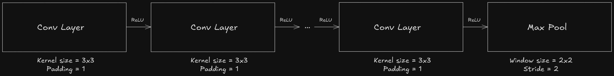

and the entire VGGNet could be represented as a series of these VGG blocks

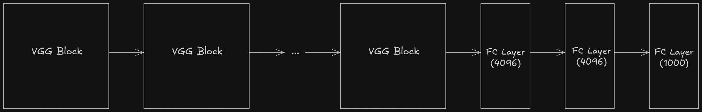

### Implementation

```python
def vgg_block(num_convs, in_channels, out_channels):
    layers = []

    for _ in range(num_convs):
        layers.append(nn.Conv2d(in_channels=in_channels, out_channels=out_channels, kernel_size=3, padding=1))
        layers.append(nn.ReLU())

    layers.append(nn.MaxPool2d(kernel_size=2, stride=2))
    return nn.Sequential(*layers)

class VGGNet(nn.Module):
    def __init__(self, arch):
        super().__init__()

        blocks = []

        for (num_convs, in_channels, out_channels) in arch:
            blocks.append(vgg_block(num_convs, in_channels, out_channels))

        self.model = nn.Sequential(
            *blocks,
            nn.Flatten(),
            nn.LazyLinear(out_features=4096),
            nn.ReLU(),
            nn.Dropout(0.5),
            nn.Linear(in_features=4096, out_features=4096),
            nn.ReLU(),
            nn.Dropout(0.5),
            nn.Linear(in_features=4096, out_features=1000)
        )

    def forward(self, x):
        x = self.model(x)
        return x
```

## Network in Network (NiN)

Network in Network or NiN was introduced in the paper [Network In Network](https://arxiv.org/pdf/1312.4400). As compared to AlexNet and VGG, which focused on improving the performance of the feature extractor portion of CNN, NiN focused on improving the performance of the classifier portion of CNN i.e. the series of fully-connected layers at the end of the CNN.

In LeNet, AlexNet and VGG, the connection between the last convolutional/pooling layer and the first fully-connected layer involves a lot of parameters.

1. For LeNet, it is 16x5x5x120 = ~48k
2. For AlexNet, it is 256x5x5x4096 = ~29M
3. For VGGNet-19, it is 512x7x7x4096 = ~103M

Another issue with LeNet, AlexNet and VGG is that there is no way to add additional non-linearity layers without changing the receptive field’s size. If fully-connected layer was added in between then the entire spatial structure which was meant to be preserved would be destroyed. The NiN paper discussed that the regular convolutional filter is a generalized linear model and the level of abstraction with it is low.

NiN aims to solve both of these problems by introducing two new ideas:

1. Use of 1x1 convolutional layer
2. Use of global average pooling layer

### 1x1 convolutional layer

First, let’s try to understand how 1x1 convolutional layer works. In the below image, the 1x1 convolutional layer, which has 192 kernels each of size 1x1, slides over the entire volume of size 64x64x192 (a feature map of size 64x64 with 192 filters) and performs element-wise multiplication. It is similar to having a single neuron with 192 weights. The 1x1 convolutional layer is referred as “mlpconv layer” in the NiN paper, as the 1x1 convolutional acts like a MLP at each spatial location.

1x1 convolutional layer is used to decrease or increase the number of feature maps easily and it can be also used to add additional non-linearity without changing the size of the receptive field. In the later sections, we will see how the 1x1 convolutional layer is used in ResNet’s bottleneck design to decrease and increase the number of feature maps for computational efficiency reasons.

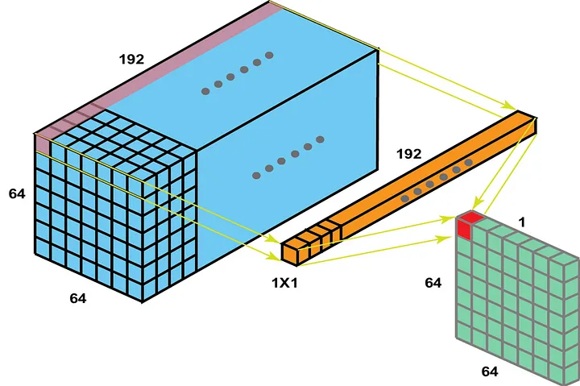

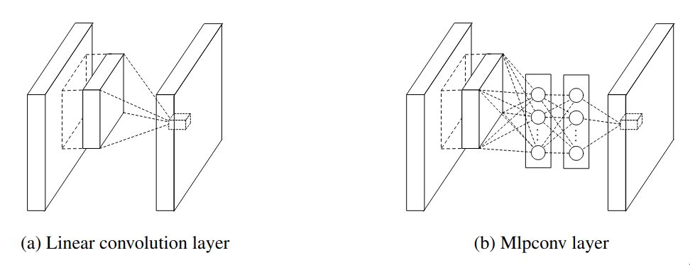

[Maxout networks](https://arxiv.org/pdf/1302.4389) is another type of network which focused on improving the level of abstraction. The core idea of maxout networks was instead of applying one linear transformation followed by a non-linearity, it applied multiple linear transformations and picked the maximum one. The issue with maxout networks is that it was capable of modeling only convex functions, but mlpconv uses MLP which is an universal function approximator.

### Global average pooling layer

Instead of having a fully-connected layer, which is used to classify the features, a global average pooling layer is used which outputs the spatial average of the last mlpconv layer which is then fed into a softmax layer to get the final probabilities. An advantage of using the global average pooling layer instead of fully-connected layer is that it doesn’t have any parameters to learn. Furthermore, the fully-connected layer is prone to overfitting and depends heavily on regularization, while the global average pooling layer itself depends as a structural regularizer, which prevents overfitting. The number of feature maps returned by the last mlpconv layer must be equal to the number of classes present in the dataset.

As the global average pooling layer is native to the convolution structure, there is no need to flatten and it solves the issue of the large number of parameters between the last convolutional/pooling layer and the first fully-connected layer.

### Architecture

As VGGNet, even NiN has the “blocks” kind of pattern which is sorta like a “micro-network”, which contains a convolutional layer followed by two 1x1 convolutional layers.


and the architecture proposed in NiN’s paper can be represented as follows, instead of alternating convolutional and pooling layer, it has alternating NiN blocks and pooling layers.

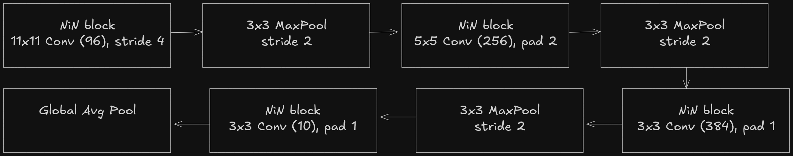

### Implementation

```python
def nin_block(out_channels, kernel_size, stride=1, padding=0):
    return nn.Sequential(
        nn.LazyConv2d(out_channels, kernel_size, stride, padding),
        nn.ReLU(),
        nn.Conv2d(out_channels, out_channels, 1),
        nn.ReLU(),
        nn.Conv2d(out_channels, out_channels, 1),
        nn.ReLU()
    )

class NiN(nn.Module):
    def __init__(self):
        super().__init__()

        self.model = nn.Sequential(
            nin_block(out_channels=96, kernel_size=11, stride=4),
            nn.MaxPool2d(kernel_size=3, stride=2),
            nin_block(out_channels=256, kernel_size=5, padding=2),
            nn.MaxPool2d(kernel_size=3, stride=2),
            nin_block(out_channels=384, kernel_size=3, padding=1),
            nn.MaxPool2d(kernel_size=3, stride=2),
            nin_block(out_channels=10, kernel_size=3, padding=1),
            nn.AdaptiveAvgPool2d(output_size=1),
            nn.Flatten()
        )
```

## GoogLeNet (Inception)

GoogLeNet was introduced in the paper [Going deeper with convolutions](https://arxiv.org/pdf/1409.4842), and it majorly focused on increasing the depth and width of the network while keeping the network highly performant. GoogLeNet is a 22 layer deep CNN (which uses the “Inception” module), in total it uses 12 times less number of parameters as compared to AlexNet while also being more accurate.

Until this point, the most straightforward way to improve the performance of a deep neural networks is to further increase their size, but it has a few major drawbacks:

1. If the size of the neural network is increased then number of parameters increases then it generally becomes more prone to overfitting.
2. If the size of the neural network is increased then it dramatically increases the use of the computational resources.

Another issue which was faced by the researchers at that time was how to design the deep convolutional neural networks? Whether to use 3x3 or 5x5 or 1x1 convolutional layer or else a max pooling layer?

The Inception module aims to solve these issues by having a “multi-branch” network which combines all of them together (1x1, 3x3, 5x5 convolutional layer and max pooling layer) and concatenates them at the end, and it is computational efficient as compared to having just 3x3 or just 5x5 convolutional layers.

### Inception V1

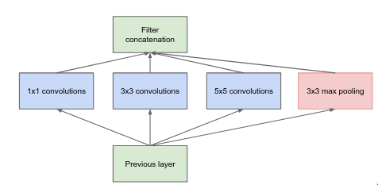

Inception module is a “multi-branch” network which applies a bunch of different filters on the image and concatenates them at the end. It is a bit similar to how the human brain processes the visual information — it uses a hierarchy of neurons. At each level, the brain processes information at multiple spatial scales, some neurons focus on fine details (small receptive field) while other focus on global structure (large receptive field), and then combining all the details from the different scales.

The “multiple spatial scales” is similar to multiple branches and different convolutional and pooling layers within them. The 1x1 convolutional layer is responsible for capturing the fine details whereas 3x3 and 5x5 convolutional layers are responsible for capturing mid and large scale details respectively.

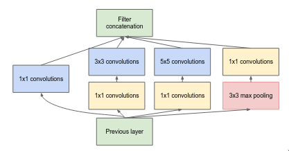

The above layer is similar to the previous one but the main difference is addition of 1x1 convolutional layers which are used to changing the number of feature maps. Before moving to computational expensive layers like 3x3 convolutional and 5x5 convolutional, the 1x1 convolutional layer reduces the number of features map. After the pooling layer, the 1x1 convolutional increases the number of feature maps so that the pooling results can be concatenated along with other branch results.

### Inception V3

The above architecture was originally presented in the paper and it is often called as Inception V1. Later, a follow-up paper titled [Rethinking the Inception Architecture for Computer Vision](https://arxiv.org/pdf/1512.00567) proposed quite a few improvements to the original Inception module architecture.

The first part of the paper discusses about how to break down larger convolutionals like 5x5 and 7x7 into series of smaller convolutionals using 3x3. Instead of using 5x5 convolutional layer, it has been replaced with series of two 3x3 convolutional layer with a non-linear activation function like ReLU in between them. Similar ideas were proposed in VGGNet’s paper.


Any NxN convolutional can be further broken down in smaller convolutionals by using asymmetric convolutionals i.e. 1xN and Nx1, but this factorization doesn’t work that well in early layer so it is instead used further down the network when the size of the feature maps are in between the range of 12 to 20.

In that paper, a term called “representational bottleneck” was often used. Representational bottleneck refers to the point in a neural network where the network’s ability to carry any important information is severely limited due to the reduction in dimensionality or spatial size. Let’s consider two approaches which involve down sampling and increasing the number of feature maps of an image.

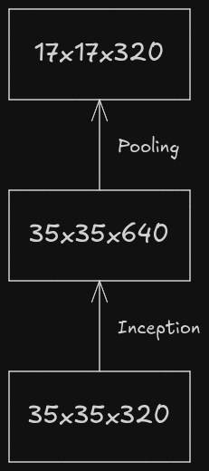

The above flow _might_ looks pretty from point-of-view of representation and flow of the information as before down sampling the feature maps, the number of channels have been increased to avoid representational bottleneck, but it is quite computationally expensive as the inception module performs convolutional operation and it is applied on the 35x35 image with 320 channels.

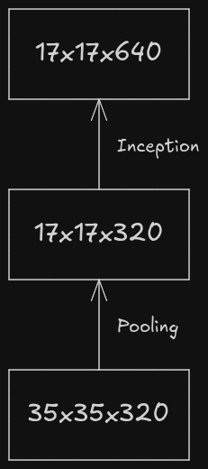

The above workflow is prone to representational bottleneck as the number of channels is increased **after** down sampling the feature maps.

The paper proposes another workflow which is computationally efficient and isn’t prone to representational bottleneck.

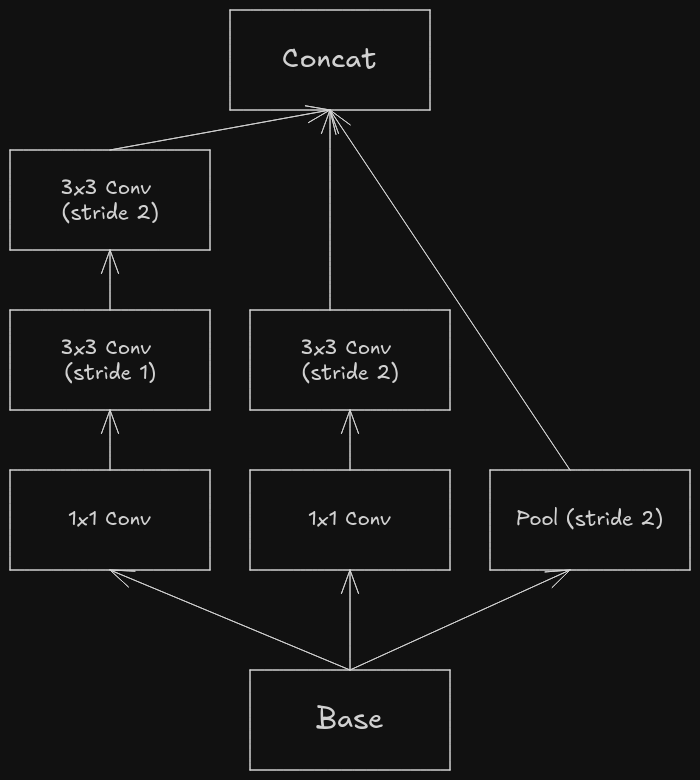

It has three branches which are processed in parallel.

1. The left-most branch first performs dimensionality reduction (reducing the number of channels) via 1x1 convolutional, to make the subsequent 3x3 convolutionals cheaper. It has two 3x3 convolutionals, the first one is responsible for increasing the number of features maps and the next one is responsible for down sampling it. It has the similar flow as the (Inception → Pooling) one except for the fact that the 3x3 convolutionals are less computationally expensive because of dimensionality reduction.
2. The middle branch is similar to the left-most branch except for the fact that it doesn’t gradually down sample the image, but does it instantly.
3. The right-most branch contains a single pooling layer.
4. At the end, the results from all the branches are concatenated.

The Inception V2 paper also introduces a new regularization technique - label smoothing. In classification related tasks, one-hot encoding is often used. For example, if there are three classes namely bird, cat and dog then the bird can be represented as `[1, 0, 0]`, a cat as `[0, 1, 0]` and a dog as `[0, 0, 1]`.

By using “hard” 1 and 0, it makes the network overconfident, as the model is incentivized to make the probability of the correct class close to 1 and probability of incorrect class close to 0, this could lead to bad generalization. To fix this issue the “hard” target labels are softened by the below formula, where $\alpha$ is the smoothing factor which is close to 0, $K$ is the number of classes and $y$ is the true label from one-hot encoding.

$$
y_{\text{smooth}} = (1 - \alpha) \cdot y + \frac{\alpha}{K}
$$

So, for correct class i.e. y = 1, the smoothed value would be $(1 - \alpha) + \frac{\alpha}{K}$ and for incorrect class i.e. y = , the smoothed value would be $\frac{\alpha}{K}$.

### Architecture

GoogLeNet’s architecture is quite big to go through all at once, so let’s go through it piece-by-piece.

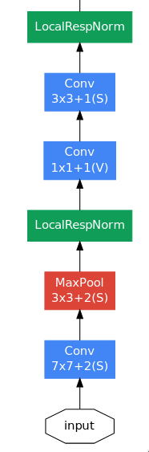

The initial few layers are quite similar to that of the AlexNet — a large convolutional layer (7x7) to capture high level spatial information quickly, followed by a bunch of max pooling and normalization layers. The final convolutional layer outputs an image of size 56x56x192, a huge number of channels containing rich information about the image’s features, which enter the series of inception module blocks.

A question which could be asked is why did GoogLeNet use a single 7x7 convolutional layer instead of series of three 3x3 convolutional layer, when both of them represent the same receptive field? I’m not quite sure of the reason but it could be something related to training deep networks which still challenging at that time as there was no BatchNorm yet.

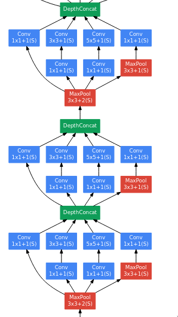

The next series of layers are just three inception module blocks placed next to each other with a max pooling layer just before the last block.

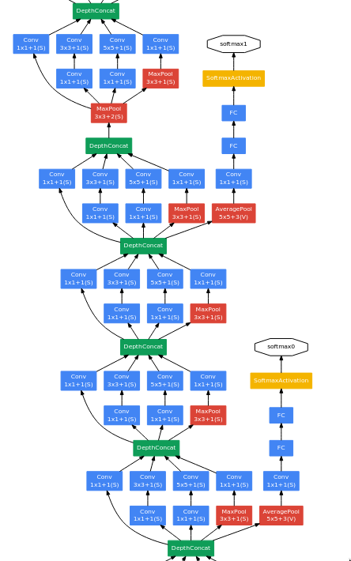

In the next series of layers, there is something interesting going on. There are two branches which gets separated out of the network and doesn't join back at all.

GoogLeNet is a quite deep, so vanishing gradients was a major issue which was faced by the researchers while trying to train it. To fix that issue, they’ve added a few branches which get separated from the network and have a softmax layer at the end — these are called the “auxiliary classifiers”.

The researchers were experimenting with the shallower versions of GoogLeNet and found that they perform quite well, so this implies that even the middle layers of a deep network can capable of learning strong and discriminative features, which helps in distinguishing between classes. So a few extra classifiers (average pooling + fully connected + softmax) are added to the network in between.

During training, the loss from these auxiliary classifiers is added to the total loss after being multiplied by 0.3. During inference, these auxiliary classifiers are ignored.

```python
total loss = main classifier loss + auxiliary classifiers loss * 0.3
```

The auxiliary classifiers were initially introduced to help the gradients flow better in very deep networks and also to improve feature learning in early layers, but on testing it was found that auxiliary classifiers don’t help with early training or convergence speed of the network — both networks (with and without them) train at a similar speed. The network with the auxiliary classifiers perform a bit better than the end, which hints that they provide generalization benefit and not training speedup. So, the auxiliary classifiers act more like regularizer.

After from these auxiliary classifiers, the remaining part is the usual series of inception module blocks.

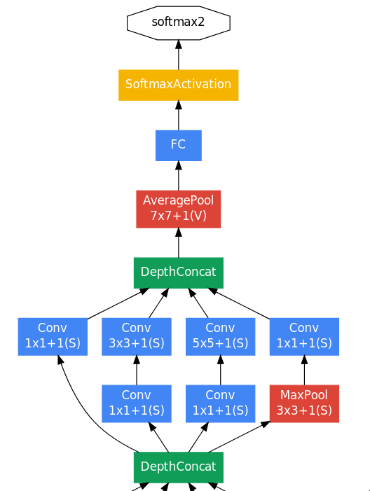

At the end, there is one inception module block followed by an average pooling layer. The main difference between NiN and GoogLeNet is that instead of directly connecting the GAP to softmax, GoogLeNet has a fully-connected layer in between. The reason for using a linear layer is that the output image size of the average pooling layer is 1x1x1024 which doesn’t correspond to the 1000 classes of ILSVRC dataset, so a fully-connected layer is used to act as an additional learnable transformation and to also convert into a vector of size 1000.

### Implementation

Let’s code out the implementation of GoogLeNet (which uses Inception V1 architecture) step-by-step, starting with the Inception block.

```python
class InceptionBlock(nn.Module):
    def __init__(self, in_channels, out_1x1, red_3x3, out_3x3, red_5x5, out_5x5, pool_proj):
        super().__init__()

        self.relu = nn.ReLU()

        self.b1 = nn.Sequential(
            nn.Conv2d(in_channels=in_channels, out_channels=out_1x1, kernel_size=1, stride=1, padding=0),
            self.relu
        )

        self.b2 = nn.Sequential(
            nn.Conv2d(in_channels=in_channels, out_channels=red_3x3, kernel_size=1, stride=1, padding=0),
            self.relu,
            nn.Conv2d(in_channels=red_3x3, out_channels=out_3x3, kernel_size=3, stride=1, padding=1),
            self.relu
        )

        self.b3 = nn.Sequential(
            nn.Conv2d(in_channels=in_channels, out_channels=red_5x5, kernel_size=1),
            self.relu,
            nn.Conv2d(in_channels=red_5x5, out_channels=out_5x5, kernel_size=5, stride=1, padding=2),
            self.relu
        )

        self.b4 = nn.Sequential(
            nn.MaxPool2d(kernel_size=3, stride=1, padding=1),
            nn.Conv2d(in_channels=in_channels, out_channels=pool_proj, kernel_size=1),
            self.relu
        )

    def forward(self, x):
        b1 = self.b1(x)
        b2 = self.b2(x)
        b3 = self.b3(x)
        b4 = self.b4(x)

        return torch.cat((b1, b2, b3, b4), dim=1)
```

The `InceptionBlock` class takes in quite a few arguments during initialization.

1. `in_channels` - Number of input channels
2. `out_1x1` - Number of output channels after 1x1 convolutional in the 1st branch
3. `red_3x3` - Number of output channels after dimensionality reduction by 1x1 convolutional in the 2nd branch
4. `out_3x3` - Number of output channels after 3x3 convolutional in the 2nd branch
5. `red_5x5` - Number of output channels after dimensionality reduction by 1x1 convolutional in the 3rd branch
6. `out_5x5` - Number of output channels after 5x5 convolutional in the 3rd branch
7. `pool_proj` - Number of output channels after 1x1 convolutional in the 4th branch

```python
class AuxiliaryClassifier(nn.Module):
    def __init__(self, in_channels, classes):
        super().__init__()

        self.relu = nn.ReLU()

        self.avgpool = nn.AvgPool2d(kernel_size=5, stride=3)
        self.conv = nn.Conv2d(in_channels=in_channels, out_channels=128, kernel_size=1)
        self.fc1 = nn.Linear(in_features=128, out_features=1024)
        self.dropout = nn.Dropout(p=0.7)
        self.fc2 = nn.Linear(in_features=1024, out_features=classes)

    def forward(self, x):
        x = self.avgpool(x)
        x = self.relu(self.conv(x))
        x = torch.flatten(x, 1)
        x = self.relu(self.dropout(self.fc1(x)))
        x = self.fc2(x)

        return x
```

We have finished writing out the implementation of the major “blocks” in GoogLeNet, so let’s move onto the actual network now. The output of `forward` method is a list of length 3.

1. The first element corresponds to the output of 1st auxiliary classifier
2. The second element corresponds to the output of the 2nd auxiliary classifier
3. The last element corresponds to the “actual/main” output of the network.

The outputs of the auxiliary classifiers can be `None` depending on whether it is ran during training or inference.

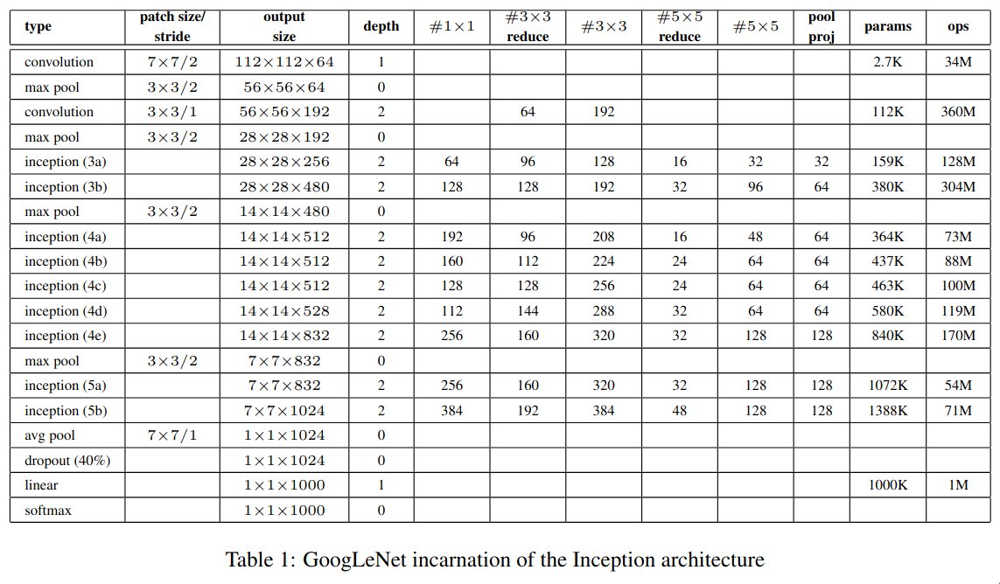

```python
class GoogLeNet(nn.Module):
    def __init__(self, in_channels, classes):
        super().__init__()

        self.relu = nn.ReLU(inplace=True)

        self.c1 = nn.Conv2d(in_channels=in_channels, out_channels=64, kernel_size=7, stride=2, padding=3)
        self.maxpool = nn.MaxPool2d(kernel_size=3, stride=2, padding=1)
        self.lrn = nn.LocalResponseNorm(size=5)
        self.c2 = nn.Conv2d(in_channels=64, out_channels=64, kernel_size=1, stride=1, padding=0)
        self.c3 = nn.Conv2d(in_channels=64, out_channels=192, kernel_size=3, stride=1, padding=1)

        self.incep_3a = InceptionBlock(in_channels=192, out_1x1=64, red_3x3=96, out_3x3=128, red_5x5=16, out_5x5=32, pool_proj=32)
        self.incep_3b = InceptionBlock(in_channels=256, out_1x1=128, red_3x3=128, out_3x3=192, red_5x5=32, out_5x5=96, pool_proj=64)

        self.incep_4a = InceptionBlock(in_channels=480, out_1x1=192, red_3x3=96, out_3x3=208, red_5x5=16, out_5x5=48, pool_proj=64)
        self.incep_4b = InceptionBlock(in_channels=512, out_1x1=160, red_3x3=112, out_3x3=224, red_5x5=24, out_5x5=64, pool_proj=64)
        self.incep_4c = InceptionBlock(in_channels=512, out_1x1=128, red_3x3=128, out_3x3=256, red_5x5=24, out_5x5=64, pool_proj=64)
        self.incep_4d = InceptionBlock(in_channels=512, out_1x1=112, red_3x3=144, out_3x3=288, red_5x5=32, out_5x5=64, pool_proj=64)
        self.incep_4e = InceptionBlock(in_channels=528, out_1x1=256, red_3x3=160, out_3x3=320, red_5x5=32, out_5x5=128, pool_proj=128)

        self.incep_5a = InceptionBlock(in_channels=832, out_1x1=256, red_3x3=160, out_3x3=320, red_5x5=32, out_5x5=128, pool_proj=128)
        self.incep_5b = InceptionBlock(in_channels=832, out_1x1=384, red_3x3=192, out_3x3=384, red_5x5=48, out_5x5=128, pool_proj=128)

        self.aux1 = AuxiliaryClassifier(in_channels=512, classes=classes)
        self.aux2 = AuxiliaryClassifier(in_channels=528, classes=classes)

        self.avgpool = nn.AvgPool2d(kernel_size=7, stride=1)
        self.dropout = nn.Dropout(p=0.4)
        self.fc = nn.Linear(in_features=1024, out_features=classes)

    def forward(self, x):
        outputs = []

        x = self.relu(self.c1(x))
        x = self.maxpool(x)
        x = self.lrn(x)

        x = self.relu(self.c2(x))
        x = self.relu(self.c3(x))
        x = self.lrn(x)
        x = self.maxpool(x)

        x = self.incep_3a(x)
        x = self.incep_3b(x)

        x = self.maxpool(x)
        x = self.incep_4a(x)

        if self.training:
            outputs.append(self.aux1(x))
        else:
            outputs.append(None)

        x = self.incep_4b(x)
        x = self.incep_4c(x)
        x = self.incep_4d(x)

        if self.training:
            outputs.append(self.aux2(x))
        else:
            outputs.append(None)

        x = self.incep_4e(x)

        x = self.maxpool(x)
        x = self.incep_5a(x)
        x = self.incep_5b(x)

        x = self.avgpool(x)
        x = self.dropout(x)
        x = torch.flatten(x, 1)
        x = self.fc(x)

        outputs.append(x)
        return outputs
```

## Residual Networks

Residual Network or ResNet was introduced in the paper [Deep Residual Learning for Image Recognition](https://arxiv.org/pdf/1512.03385), and it primarily focused on developing a framework which simplifies the process of training deep neural networks. It is one of the most important papers in the context of deep learning, as the core idea of the paper (residual connections) is used everywhere nowadays to train deep neural networks efficiently.

It’s 2015 and until this point, it was obvious to the researchers that deeper the network, better the results but the issue was how to train these networks efficiently? The below image shows the training and test loss between two networks. The 56-layer network performs worse compared to the 20-layer network on both training and test loss, but what could be the reason? It isn’t overfitting as it performs worse on both training and test loss and it isn’t vanishing gradient as well as this issue was persistent even after adding batch normalization layers to the deeper network. The reason was that it is hard to train deep neural networks.

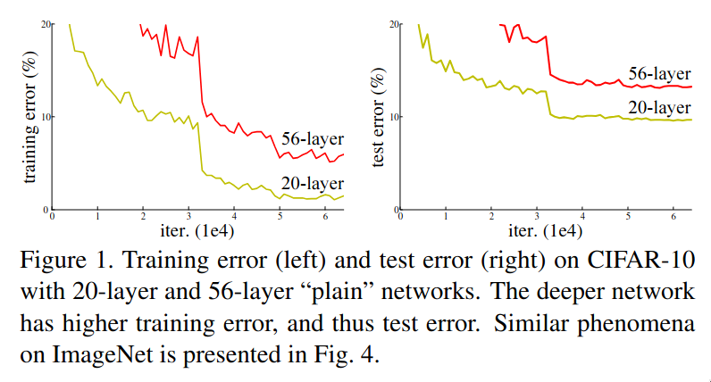

The issue of “not being able to train deep neural networks efficiently” is clearly visible in another example. Consider a deep network where the initial few layers are copied from a learned shallow network and the remaining layers are basically “identity” layers i.e. they try to learn the identity function. Theoretically, the deeper network shouldn’t produce a training error higher than the shallower network. But experiments showed that the solvers during that time (algorithms which are responsible to train the network) were not able to reach the aforementioned ideal case.

The above problem can be thought in a different manner, instead of trying to directly fit the desired underlying mapping, we try to fit the residual mapping and add the input mapping at the end. Neural networks struggle with trying to fit identity functions, mainly due to non-linear activation functions, random initialization of weights and biases. Even if the identity function seems simple, stacking multiple non-linear layers makes it nontrivial to preserve the input exactly. But it is pretty easy for neural networks to fit the zero mapping.

Consider that a model takes $x$ as the input and the desired output mapping is $\mathcal{H}(x)$ then we let the model fit the residual mapping i.e. $\mathcal{F}(x) = \mathcal{H}(x) - x$ and the output would be $\mathcal{F}(x) + x$. So if the desired output is identity mapping then the model would have just learn the zero mapping, which is much easier as it just involves pushing weights and biases towards zero.

The core idea of residual networks is instead of learning everything from scratch, just let the network learn the “differences” i.e. residuals and build upon it. This allows addition of more stacked layer without affecting the performance as the layers which aren’t “useful” would default to identity mapping, so the deeper networks won’t perform worse compared to the shallower ones.

### Residual blocks

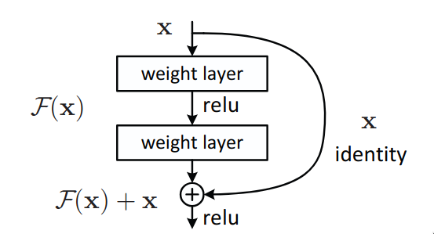

The above image is a basic representation of a residual block. It takes in $x$ as in input and learns the residual mapping $\mathcal{F}(x)$ and finally returns $\mathcal{F}(x) + x$ as an input. The original input $x$ is added to the residual mapping $\mathcal{F}(x)$ via skip or residual connections, which is sort of like a “shortcut” to transfer the information within the network. Residual block is _sorta_ like a multi-branch network (like Inception) but with two branches and one of them is an identity mapping.

The paper proposed two architectures for the residual blocks which are used in the network — the “usual” residual block and a bottleneck block.

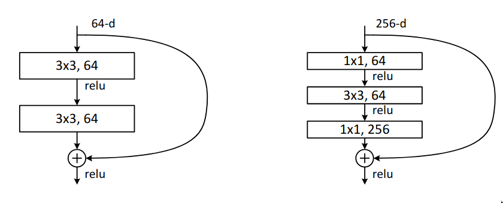

Within the bottleneck block, it has two 1x1 convolutional blocks which perform dimensionality reduction before executing 3x3 convolutional on an image with 256 feature maps, which is quite computationally expensive and at the end it is resized back to 256 features maps using another 1x1 convolutional, so that it the input and the output can be added. In residual blocks, the input and the output needs to have the same dimensions. If it is required to change the number of channels, then a 1x1 convolutional layer can be used in the skip connection to perform dimensionality reduction on the input to match the number of channels.

### Architecture

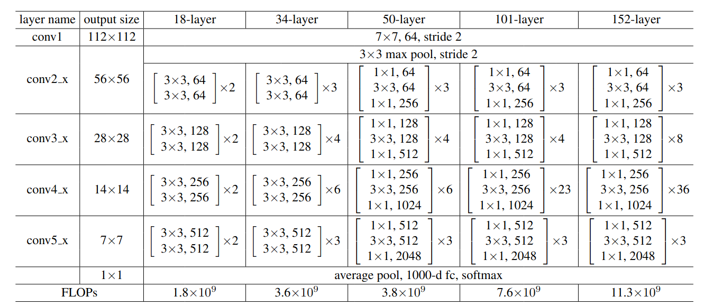

The paper proposed quite a few different network designs. In this section, we will go through the architecture of ResNet50. The major difference between the shallower networks like ResNet18 and ResNet34 and the other networks is that the other deeper networks use the bottleneck design of the residual block.

Residual networks follow the similar repeating-layer strategy as in VGGNet. Most of the blocks have the exact same structure — a bottleneck residual block which has an _expansion_ of 4 i.e. the number of output channels is 4 times the number of output channels of the 3x3 convolutional layer.

At the end, there is an average pooling layer and another fully connected layer which act as the classifier. Overall, the network design is quite simple.

### Implementation

```python
import torch
from torch import nn

class ResidualBlock(nn.Module):
    expansion = 4

    def __init__(self, in_channels, out_channels, stride, use_conv1x1):
        self.conv1 = nn.Conv2d(in_channels=in_channels, out_channels=out_channels, kernel_size=1)
        self.bn1 = nn.BatchNorm2d(num_features=out_channels)

        self.conv2 = nn.Conv2d(in_channels=out_channels, out_channels=out_channels, kernel_size=3, stride=stride, padding=1)
        self.bn2 = nn.BatchNorm2d(num_features=out_channels)

        self.conv3 = nn.Conv2d(in_channels=out_channels, out_channels=out_channels * self.expansion, kernel_size=1)
        self.bn3 = nn.BatchNorm2d(out_channels * self.expansion)

        self.downsample = nn.Sequential(
            nn.Conv2d(in_channels=in_channels, out_channels=out_channels * self.expansion, kernel_size=1, stride=2),
            nn.BatchNorm2d(out_channels * self.expansion)
        ) if use_conv1x1 else None

        self.relu = nn.ReLU(inplace=True)

    def forward(self, x):
        identity = x

        out = self.conv1(x)
        out = self.bn1(out)
        out = self.relu(out)

        out = self.conv2(out)
        out = self.bn2(out)
        out = self.relu(out)

        out = self.conv3(out)
        out = self.bn3(out)

        if self.downsample:
            identity = self.downsample(identity)

        out += identity
        out = self.relu(out)

        return out

class ResNet50(nn.Module):
    def __init__(self, block):
        super().__init__()

        self.conv1 = nn.Conv2d(in_channels=3, out_channels=64, stride=2, padding=3, kernel_size=7)
        self.bn1 = nn.BatchNorm2d(num_features=64)
        self.maxpool = nn.MaxPool2d(kernel_size=3, stride=2, padding=1)

        self.in_channels = 64

        self.layer1 = self._make_layer(block, 3, 64, 1)
        self.layer2 = self._make_layer(block, 4, 128, 2)
        self.layer3 = self._make_layer(block, 6, 256, 2)
        self.layer4 = self._make_layer(block, 3, 512, 2)

        self.avgpool = nn.AdaptiveAvgPool2d((1, 1))
        self.fc = nn.Linear(512 * block.expansion, 1000)

        self.relu = nn.ReLU(inplace=True)

    def _make_layer(self, block, num_blocks, out_channels, stride):
        use_conv1x1 = self.in_channels != out_channels * block.expansion

        layers = [block(self.in_channels, out_channels, stride, use_conv1x1)]

        self.in_channels = out_channels * block.expansion

        for _ in range(1, num_blocks):
            layers.append(block(self.in_channels, out_channels))

        return nn.Sequential(*layers)

    def forward(self, x):
        x = self.conv1(x)
        x = self.bn1(x)
        x = self.relu(x)

        x = self.maxpool(x)

        x = self.layer1(x)
        x = self.layer2(x)
        x = self.layer3(x)
        x = self.layer4(x)

        x = self.avgpool(x)
        x = torch.flatten(x, 1)
        x = self.fc(x)

        return x
```

## Inception-ResNet

A paper titled [Inception-v4, Inception-ResNet and the Impact of Residual Connections on Learning](https://arxiv.org/pdf/1602.07261) proposed a new Inception module which combines the powers of both multi-branch networks like Inception v1 and v2 and residual connections. The paper also proposes a new Inception network design, which is much more optimization and has a different design for the Inception module for each grid size. In this section, we will mainly discuss about Inception-ResNet.

### Architecture

The high level difference between a plain Inception block and a Inception-ResNet block is that instead of concatenation, summation operation is used and a skip connection is present. The paper proposed two network designs — Inception-ResNet-v1 (roughly the computational cost of Inception-v3) and Inception-ResNet-v2 (roughly the computational cost of Inception-v4) . Let’s go through the Inception-ResNet-v1.

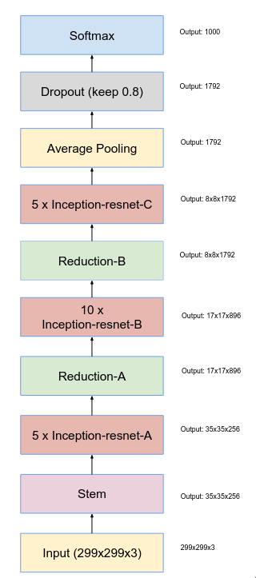

The above image is entire network design of Inception-ResNet-v1. It has a couple of building blocks like “Stem”, “Inception-ResNet-A”, “Reduction-A”, “Inception-ResNet-B”, “Reduction-B” and “Inception-ResNet-C”.

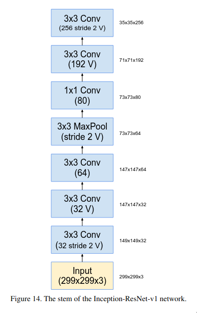

Stem is basically the initial few layers of the network, it consists of a series of 3x3 convolutional layer followed by a max pooling layer.

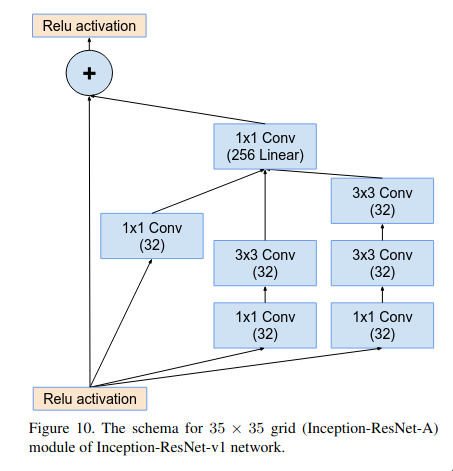

The Inception-ResNet-A block is quite similar to the plain Inception block but there is one major difference which is that it doesn’t have a max pooling layer as in blocks with residual connections the spatial size of the input and output must be the same to perform the summation operation. The 1x1 convolutional layer at the end of the multi-branch micro-network is meant to match the number of the features maps of input and output.

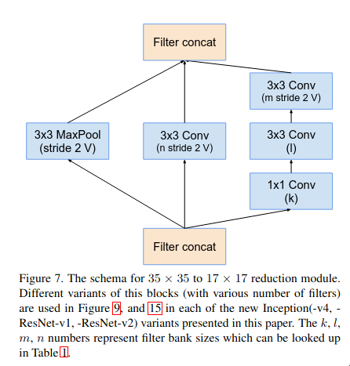

The reduction-A is multi-branch micro-network block which is used for efficiently down sampling the feature map without facing representational bottleneck. The “what” behind representational bottleneck and the reasoning behind that setup was already discussed in [Inception-V3 section](https://www.notion.so/Exploring-different-CNNs-1fdfc668bdb380baad75c82e81bce6e2?pvs=21).

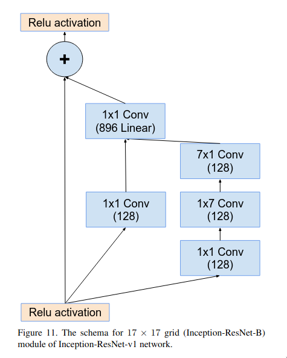

The Inception-ResNet-B block is pretty similar as Inception-ResNet-A but instead of three branches, it only has two branches and it applies the convolution operation over a larger area (7x7). It uses asymmetric convolutional layers (7x1 and 1x7) for reducing the number of parameters.

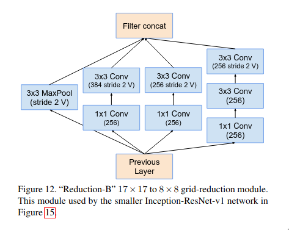

The reduction-B block is another multi-branch micro-network block which is used for efficient dimension reduction. This block is much more deeper and more feature-preserving (retains more richer representations) as compared to reduction-A block. Reduction-A block is a shallower and prioritizes speed and aggressive down sampling.

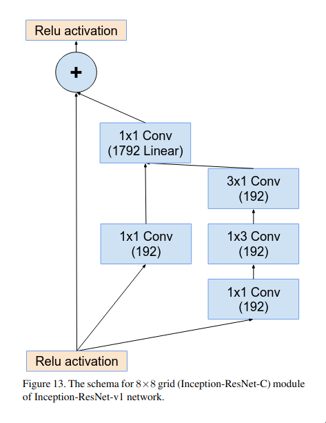

The Inception-ResNet-C block is quite similar to Inception-ResNet-A block but the major differences are that it just has 2 branches instead of 3. The reason behind it is that Inception-ResNet-C performs convolution on larger number of channels so keep it computationally efficient, the number of branches were reduced to 2 from 3.

There is a small caveat within the Inception-ResNet blocks — while experimenting the researchers have found out that if the number of filters exceed 1000, then the network become unstable and _dies_ early in the training. This issue wasn’t solved by either lowering the learning rate or adding more batch normalization layers. The issue was that the residuals were dominating the input which causes the activations to either explode or collapse to zero. The proposed solution was that instead of directly adding the entire residual with the input, multiply the residual with a small factor (between 0.1 to 0.3) and then add it to the input.

$$
\text{output} = \text{input} + \alpha \cdot \text{residual}; \; \alpha \in [0.1, 0.3]
$$

At the end, the network uses a global average pooling + fully-connected layer (with dropout) for the classification, same as GoogLeNet.

### Implementation

```python
import torch
from torch import nn

class Conv(nn.Module):
    def __init__(self, in_channels, out_channels, kernel_size, stride = 1, padding: int | str = 0):
        super().__init__()

        self.conv = nn.Conv2d(in_channels, out_channels, kernel_size, stride, padding)
        self.relu = nn.ReLU(inplace=True)

    def forward(self, x):
        x = self.conv(x)
        x = self.relu(x)

        return x

class InceptionResNetA(nn.Module):
    def __init__(self, in_channels):
        super().__init__()

        self.b1 = Conv(in_channels=in_channels, out_channels=32, kernel_size=1, padding="same")

        self.b2 = nn.Sequential(
            Conv(in_channels=in_channels, out_channels=32, kernel_size=1, padding="same"),
            Conv(in_channels=32, out_channels=32, kernel_size=3, padding="same")
        )

        self.b3 = nn.Sequential(
            Conv(in_channels=in_channels, out_channels=32, kernel_size=1, padding="same"),
            Conv(in_channels=32, out_channels=32, kernel_size=3, padding="same"),
            Conv(in_channels=32, out_channels=32, kernel_size=3, padding="same")
        )

        self.conv_linear = nn.Conv2d(in_channels=32 * 3, out_channels=256, kernel_size=1)
        self.relu = nn.ReLU(inplace=True)

    def forward(self, x):
        identity = x

        b1 = self.b1(x)
        b2 = self.b2(x)
        b3 = self.b3(x)

        out = torch.concat([b1, b2, b3], 1)
        out = self.conv_linear(out)

        out = identity + 0.2 * out

        out = self.relu(out)
        return out

class ReductionA(nn.Module):
    def __init__(self, in_channels):
        super().__init__()

        self.b1 = nn.MaxPool2d(kernel_size=3, stride=2)
        self.b2 = Conv(in_channels=in_channels, out_channels=384, kernel_size=3, stride=2)
        self.b3 = nn.Sequential(
            Conv(in_channels=in_channels, out_channels=192, kernel_size=1, padding="same"),
            Conv(in_channels=192, out_channels=192, kernel_size=3, padding="same"),
            Conv(in_channels=192, out_channels=256, kernel_size=3, stride=2)
        )

    def forward(self, x):
        b1 = self.b1(x)
        b2 = self.b2(x)
        b3 = self.b3(x)

        out = torch.concat([b1, b2, b3], 1)
        return out

class InceptionResNetB(nn.Module):
    def __init__(self, in_channels):
        super().__init__()

        self.b1 = Conv(in_channels=in_channels, out_channels=128, kernel_size=1, padding="same")
        self.b2 = nn.Sequential(
            Conv(in_channels=in_channels, out_channels=128, kernel_size=1, padding="same"),
            Conv(in_channels=128, out_channels=128, kernel_size=(1, 7), padding="same"),
            Conv(in_channels=128, out_channels=128, kernel_size=(7, 1), padding="same")
        )

        self.conv_linear = nn.Conv2d(in_channels=128 * 2, out_channels=896, kernel_size=1, padding="same")
        self.relu = nn.ReLU(inplace=True)

    def forward(self, x):
        identity = x

        b1 = self.b1(x)
        b2 = self.b2(x)

        out = torch.concat([b1, b2], 1)
        out = self.conv_linear(out)

        out = identity + 0.2 * out
        out = self.relu(out)

        return out

class ReductionB(nn.Module):
    def __init__(self, in_channels):
        super().__init__()

        self.b1 = nn.MaxPool2d(kernel_size=3, stride=2)
        self.b2 = nn.Sequential(
            Conv(in_channels=in_channels, out_channels=256, kernel_size=1, padding="same"),
            Conv(in_channels=256, out_channels=384, kernel_size=3, stride=2)
        )
        self.b3 = nn.Sequential(
            Conv(in_channels=in_channels, out_channels=256, kernel_size=1, padding="same"),
            Conv(in_channels=256, out_channels=256, kernel_size=3, stride=2)
        )
        self.b4 = nn.Sequential(
            Conv(in_channels=in_channels, out_channels=256, kernel_size=1, padding="same"),
            Conv(in_channels=256, out_channels=256, kernel_size=3, padding="same"),
            Conv(in_channels=256, out_channels=256, kernel_size=3, stride=2)
        )

    def forward(self, x):
        b1 = self.b1(x)
        b2 = self.b2(x)
        b3 = self.b3(x)
        b4 = self.b4(x)

        return torch.concat([b1, b2, b3, b4], 1)

class InceptionResNetC(nn.Module):
    def __init__(self, in_channels):
        super().__init__()

        self.b1 = Conv(in_channels=in_channels, out_channels=192, kernel_size=1, padding="same")
        self.b2 = nn.Sequential(
            Conv(in_channels=in_channels, out_channels=192, kernel_size=1, padding="same"),
            Conv(in_channels=192, out_channels=192, kernel_size=(1, 3), padding="same"),
            Conv(in_channels=192, out_channels=192, kernel_size=(3, 1), padding="same"),
        )

        self.conv_linear = Conv(in_channels=192 * 2, out_channels=1792, kernel_size=1, padding="same")
        self.relu = nn.ReLU(inplace=True)

    def forward(self, x):
        identity = x

        b1 = self.b1(x)
        b2 = self.b2(x)

        out = torch.concat([b1, b2], 1)
        out = self.conv_linear(out)

        out = identity + 0.2 * out
        out = self.relu(out)

        return out
```

## ResNeXt

A paper titled [Aggregated Residual Transformations for Deep Neural Networks](https://arxiv.org/pdf/1611.05431) proposed a new architecture called “ResNeXt”. The paper mainly focused on developing an architecture which follows the repeating-layer strategy, like the one present in VGGNet and ResNet but also uses the split-transform-merge strategy, like the one present in Inception module. The main issue with Inception is that each module is tailored for a specific transformation (the number of filters and their sizes). Unlike Inception, ResNeXt adopts _same_ transformation in all branches, thus minimizing the need for manual tuning of each branch.

### ResNeXt block

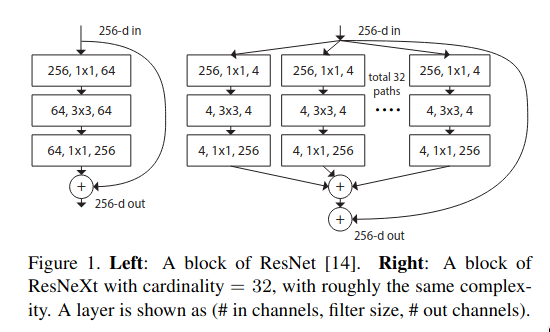

The above image shows the differences between the bottleneck block in ResNet and a basic ResNeXt block. The ResNeXt block has multi-branch setup like Inception, even though the structure for each branch is the same — the weights and biases are the different so they can learn _different_ features. At the end, the results from all of the parallel paths are aggregated via summation. ResNeXt introduces a new dimension known as “cardinality” — the number of parallel paths. The author of the paper argue that cardinality is an essential dimension and can be more effective than depth and width of the network.

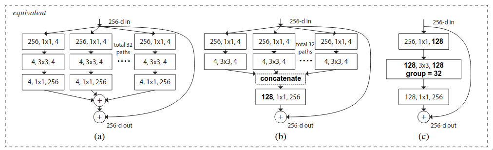

The paper proposed three block architectures which are mathematically equivalent but one is much more computationally efficient compared to the previous one.

1. In Figure-(a), each of the 32 parallel paths are implemented separately and all of them have to be stored on the memory and for executing the 3x3 convolutional on each of the path, a single kernel call is required.
2. In Figure-(b), a much more computationally efficient tensor operation is used to aggregate the outputs from the residual parallel paths. Instead of summing, concatenation and projection is used.
3. In Figure-(c), all of the parallel paths are replaced by group convolution, which is much more efficient as it is just one single layer so it takes up less memory and a single kernel call is required to execute it in total.

One of the experiments conducted by the authors was to evaluate the tradeoff between cardinality and width. They chose two types of networks — 50 layered and 101 layered, and evaluated the tradeoff between the traditional ResNet and ResNeXt by increasing the cardinality while keeping the total complexity cost constant.

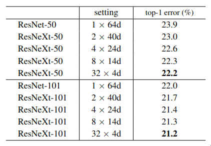

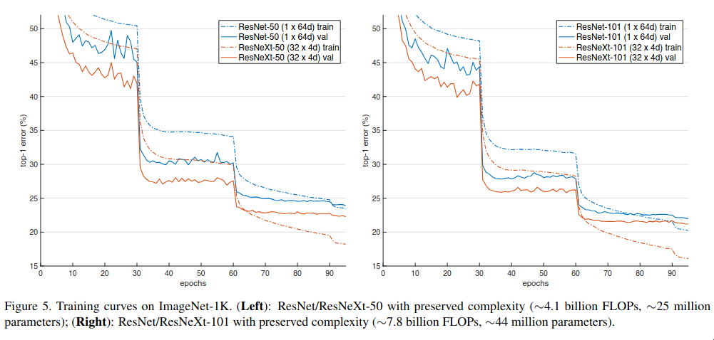

It is evident from the above table that as the cardinality increases, the accuracy increases. ResNeXt had lower validation as well training loss — so not only it was able to generalize better, it was also able to fit the data better, but as the width decreases the accuracy gets saturated.

Cardinality increases the diversity, each branch learns a different feature and overall improves the representational richness while keeping the total capacity fixed, but when width becomes very small, each branch has very few channels to work with.

### Group convolutions

The idea of group convolutions was first used in AlexNet. The GPUs during 2012 had very limited memory and the authors were not able the entire AlexNet model on a single GTX 580 so they had to split the model across two GPUs. In each layers, half of the channels were processed by GPU 1 and the other on another GPU.

The authors of ResNeXt used this idea and replaced the parallel paths with a group convolution, which is better in terms of computational efficiency.

In group convolution, the channels of the input image is split into different groups and each group has its own set of kernels, and the output from each group is concatenated at the end. The kernels of each group learns a different feature.

Consider a convolutional layer which takes in a feature map of size $32 \times 64 \times 64$ and outputs a feature map of size $64 \times 64 \times 64$ with a kernel of size $3 \times 3$, then the layer contains 64 kernels and the shape of each kernel would be $32 \times 3 \times 3$ . If instead of traditional convolutional, group convolution was used and the numbers of groups was set to 4, then each group would process $\frac{32}{4} = 8$ channels of the input feature map and the output of each group would contain $\frac{64}{4} = 16$ channels. The size of kernel in each group would be $8 \times 3 \times 3$.

### Architecture

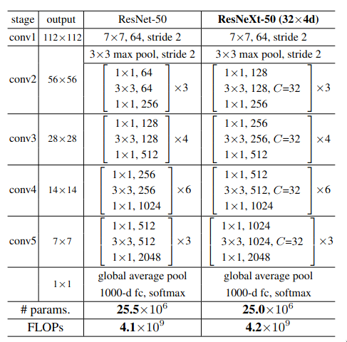

The architecture of ResNeXt-50 is quite similar to the architecture of ResNet-50, except for the additional dimension which is introduced to the network — cardinality. The first 1x1 convolutional in each ResNeXt block has double the output feature maps as compared to its corresponding one in ResNet. The reason behind it is to have more number of channels per group. If in the first ResNeXt block, the initial 1x1 convolutional layer output 64 features map then with cardinality of 32, each group would only get 2 channels to process, which is quite less.

### Implementation

```python
import torch
from torch import nn

class ResNeXtBlock(nn.Module):
    expansion = 4

    def __init__(self, in_channels, out_channels, stride=1, cardinality=32, use_conv1x1=True):
        super().__init__()

        self.conv1 = nn.Conv2d(in_channels=in_channels, out_channels=out_channels, kernel_size=1)
        self.bn1 = nn.BatchNorm2d(num_features=out_channels)

        self.conv2 = nn.Conv2d(in_channels=out_channels, out_channels=out_channels, kernel_size=3, stride=stride, groups=cardinality)
        self.bn2 = nn.BatchNorm2d(num_features=out_channels)

        self.conv3 = nn.Conv2d(in_channels=out_channels, out_channels=out_channels * self.expansion, kernel_size=1, stride=1)
        self.bn3 = nn.BatchNorm2d(num_features=out_channels * self.expansion)

        self.relu = nn.ReLU(inplace=True)

        self.dim_reduction = nn.Sequential(
            nn.Conv2d(in_channels=in_channels, out_channels=out_channels * self.expansion, kernel_size=1, stride=2),
            nn.BatchNorm2d(num_features=out_channels * self.expansion)
        ) if use_conv1x1 else None

    def forward(self, x):
        identity = x

        out = self.conv1(x)
        out = self.bn1(out)
        out = self.relu(out)

        out = self.conv2(out)
        out = self.bn2(out)
        out = self.relu(out)

        out = self.conv3(out)
        out = self.bn3(out)

        if self.dim_reduction:
            identity = self.dim_reduction(identity)

        out += identity
        out = self.relu(out)

        return out

class ResNeXtNet(nn.Module):
    def __init__(self, in_channels, block, num_blocks: list[int], base_channels: list[float]):
        super().__init__()

        self.conv1 = nn.Conv2d(in_channels=in_channels, out_channels=64, kernel_size=7, stride=2)
        self.bn1 = nn.BatchNorm2d(num_features=64)
        self.maxpool = nn.MaxPool2d(kernel_size=3, stride=2)

        self.in_channels = in_channels
        self.expansion = 4
        base_channels = [int(i / self.expansion) for i in base_channels]

        self.layer1 = self._make_layer(block, num_blocks[0], base_channels[0], 1, 32)
        self.layer2 = self._make_layer(block, num_blocks[1], base_channels[1], 2, 32)
        self.layer3 = self._make_layer(block, num_blocks[2], base_channels[2], 2, 32)
        self.layer4 = self._make_layer(block, num_blocks[3], base_channels[3], 2, 32)

        self.relu = nn.ReLU(inplace=True)

        self.avgpool = nn.AdaptiveAvgPool2d((1, 1))
        self.fc = nn.Linear(in_features=512 * block.expansion, out_features=1000)

    def _make_layer(self, block, num_blocks, out_channels, stride, cardinality):
        use_conv1x1 = self.in_channels != out_channels * self.expansion

        layers = []
        layers.append(block(self.in_channels, out_channels, stride, cardinality, use_conv1x1))

        self.in_channels = out_channels * self.expansion

        for _ in range(1, num_blocks):
            layers.append(block(self.in_channels, out_channels, 1, cardinality))

        return nn.Sequential(*layers)

    def forward(self, x):
        x = self.conv1(x)
        x = self.bn1(x)
        x = self.relu(x)

        x = self.maxpool(x)

        x = self.layer1(x)
        x = self.layer2(x)
        x = self.layer3(x)
        x = self.layer4(x)

        x = self.avgpool(x)
        x = torch.flatten(x, 1)
        x = self.fc(x)
```

## Wrapping up

Well, that’s it for this blog, I hope that it was useful. I’ve tried to explain the key concepts of each architecture in simple language — what were the problems which the authors focused on, how were they resolved, are they any new concepts which were proposed by the authors and if yes, then what are they, and have tried to include PyTorch implementations as well. I have mostly tried to go through the actual papers and have used [d2l.ai](https://d2l.ai) as a supplement.

## References

1. [ImageNet Classification with Deep Convolutional Neural Networks](https://proceedings.neurips.cc/paper_files/paper/2012/file/c399862d3b9d6b76c8436e924a68c45b-Paper.pdf)
2. [Very deep convolutional networks for large-scale image recognition](https://arxiv.org/pdf/1409.1556)
3. [Network in network](https://arxiv.org/pdf/1312.4400)
4. [Going deeper with convolutions](https://arxiv.org/pdf/1409.4842)
5. [Rethinking the Inception Architecture for Computer Vision](https://arxiv.org/pdf/1512.00567)
6. [Deep Residual Learning for Image Recognition](https://arxiv.org/pdf/1512.03385)
7. [Inception-v4, Inception-ResNet and the Impact of Residual Connections on Learning](https://arxiv.org/pdf/1602.07261)
8. [Aggregated Residual Transformations for Deep Neural Networks](https://arxiv.org/pdf/1611.05431)
9. [Dive into Deep Learning](https://d2l.ai)
