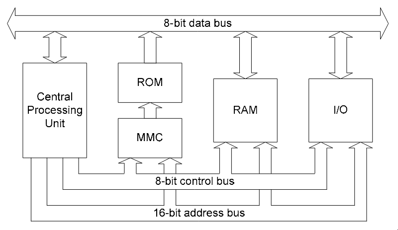
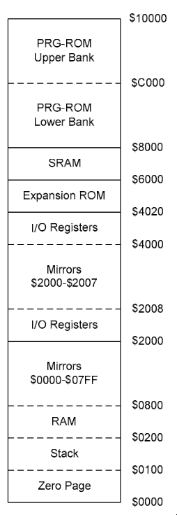
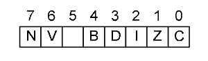

> [!warning]
> This is not a complete technical overview of the NES. These are personal notes on the NES and its technical specifications, updated as my understanding improves and as development on my NES emulator progresses.

I recently started working on an NES emulator ([veyra](https://github.com/0xmukesh/veyra)). This led me to explore multiple resources to understand how the NES works under the hood. The following content serves as an aggregated view of those resources. All referenced materials are linked at the end.

## CPU

The NES used a variant of the [standard 6502](https://en.wikipedia.org/wiki/MOS_Technology_6502) processor; it was the [Ricoh 2A03](https://en.wikipedia.org/wiki/Ricoh_2A03). It is an 8-bit processor and follows little-endian format, i.e., the least significant byte is stored at the lowest memory address. Some of the major differences between the standard 6502 and the Ricoh 2A03 are that the latter could serve as both a pseudo APU (audio processing unit) and a CPU, and it did not support [BCD](https://en.wikipedia.org/wiki/Binary-coded_decimal) (binary-coded decimal).

The CPU accesses memory through buses. The memory within the NES can be split into three major parts:
- cartridge ROM
- internal RAM of the CPU
- I/O registers — the NES uses memory-mapped I/O, i.e., data can be transferred among devices by writing to a particular address in memory

The above diagram shows that the processor system has three buses via which different components communicate with each other. Here is what each one of them does in brief:
- 8-bit data bus — carries the data which is being read or written. It is bidirectional in nature.
- 16-bit address bus — carries the 16-bit address where the CPU is trying to read/write.
- 8-bit control bus — carries signals like `READ`, `WRITE`, `RESET`, `IRQ` (interrupt requests). It is used to determine what *kind* of operation is being executed.

As the NES used a 16-bit address bus, it could support 64 KB of memory with addresses from 0x0000 to 0xFFFF. The following image shows the memory map of the CPU, which shows how the 64 KB is split and how various information is laid out in memory.

### memory map

#### RAM

**0x0000 to 0x1FFF** contains the CPU's RAM. 0x2000 in decimal is 8192, which would translate to 8 KiB, but an interesting part regarding this is that the NES has only 2 KiB. The usable RAM is present from 0x0000 to 0x07FF, which is then *mirrored* three times to create 8 KiB in the memory map. The reason for this is **mirroring**. If 0x0000 and 0x1FFF are represented in binary:

- 0x0000 = 0000 0000 0000 0000  
- 0x1FFF = 0001 1111 1111 1111  

The address decoder logic to determine whether the RAM was being accessed was just a simple 3-input NOR gate to check whether the upper three bits (A15, A14, and A13) of the address are all zero or not. This leaves 13 bits to work with, and 2^13 = 8 KiB. The CPU has 2 KiB of internal RAM because A12 and A11 are ignored. If **0x0000 to 0x0800** had been chosen for RAM in the memory map, then the address decoder logic to determine whether RAM was being accessed would require checking whether A15, A14, A13, A12, and A11 are all zero. At the time when the NES was being developed, only 3-input and 4-input NOR gates were available. Due to technology constraints and to keep the product's cost low, A12 and A11 are simply ignored, which causes mirroring.

The RAM memory map is divided into multiple sub-regions as follows:
- **0x0000 to 0x00FF** refers to the zero page, as they represent the first 256 bytes, and some instructions use zero-page addressing modes for quicker reads and writes.
- **0x0100 to 0x01FF** contains the stack of the CPU.
- **0x0200 to 0x07FF** contains the actual RAM, which is 1.5 KiB.
- **0x0800 to 0x1FFF** contains mirrors of **0x0000 to 0x07FF**.

#### I/O registers

**0x2000 to 0x401F** contains memory-mapped I/O registers. PPU (picture processing unit, more on this in later sections) related registers are present in **0x2000 to 0x2008**, and a similar mirroring effect can be seen here as well. The remaining I/O registers are present in **0x4000 to 0x4020**.

#### expansion ROM

**0x4020 to 0x5FFF** contains cartridge hardware extensions such as additional program ROM, extra sound hardware (extra sound channels), custom registers, etc.

#### SRAM

**0x6000 to 0x7FFF** refers to SRAM, which was generally used to save game state.

#### PRGROM

**0x8000 to 0xFFFF** contains the game's actual code, i.e., raw CPU instructions which are iterated and executed by the CPU at each step. This region is memory-mapped with the cartridge's ROM. It is split into two 16 KiB banks (similar wording appears in the iNES file format). If there is a game whose code is more than 32 KiB in size, then the MMC comes into play. MMC, or memory management controller, swaps different chunks of ROM into the CPU's addressable window on the fly and determines which banks are to be loaded into memory. It sits between the CPU and ROM, intercepting the signals and remapping them.

### registers

The 6502 has three special-purpose registers (program counter, stack pointer, processor status) and three general-purpose registers (accumulator, X register, Y register).

- **program counter (PC)** — it holds the 16-bit address of the next instruction which is to be executed.
- **stack pointer (SP)** — it holds an 8-bit value which acts like an offset from 0x0100. The initial value is 0x01FF, and when a byte is pushed to the stack, the stack pointer is decreased and vice versa.
- **accumulator (A)** — it is an 8-bit register which stores the value of arithmetic and logic operations.
- **index register X/Y (X/Y)** — these are 8-bit registers which are typically used as counters or offsets for certain addressing modes.
- **processor status (P)** — it is an 8-bit register which contains eight single-bit status flags.

- **bit 7 (negative, N)** — set if the result of an operation is negative, i.e., bit 7 of the result is 1.
- **bit 6 (overflow, V)** — set if the result of a signed arithmetic operation overflowed, i.e., the result is too large for a signed byte. It is determined by looking at the carry between bits 6 and 7 and between bit 7 and the carry flag, i.e., whether the carry-in bit and carry-out bit for bit 7 are different or not.
- **bit 5 (unused)** — always set to 1.
- **bit 4 (break, B)** — it acts like a transient signal in the CPU. If the flags were pushed while processing an interrupt, then it is 0 and 1 when it is pushed by instructions (`BRK`, `PHP`).
- **bit 3 (decimal mode, D)** — when the decimal mode flag is set, the processor will obey the rules of [binary-coded decimal](https://en.wikipedia.org/wiki/Binary-coded_decimal) during arithmetic operations. It is not used in the Ricoh 2A03 as it does not support binary-coded decimal.
- **bit 2 (interrupt disable, I)** — set when the [SEI](https://www.nesdev.org/obelisk-6502-guide/reference.html#SEI) instruction is executed.
- **bit 1 (zero, Z)** — set if the result of the operation was 0.
- **bit 0 (carry, C)** — set if an operation produced a carry/borrow.

### addressing modes

The 6502 provides multiple different ways to address particular locations present in memory.

- **zero page** — zero-page addressing takes a single operand which acts like a pointer to an address in the zero page where the data to be operated on can be found.
- **indexed zero page** — indexed zero-page addressing takes a single operand and adds the value of an index register (X register for `zero page, X` and Y register for `zero page, Y`) to it to give an address in (0x0000 to 0x00FF), i.e., the addition wraps around.
- **absolute** — absolute addressing takes two operands which combine to form a full 16-bit address that contains the data to be operated on. The sequence of operands follows little-endian format, i.e., least significant byte first.
- **indexed absolute** — similar to indexed zero page, indexed absolute takes two operands and the address is then added to the value of the index register to obtain the final address.
- **indirect** — indirect addressing takes two operands which combine to form a 16-bit address which stores the least significant byte of another 16-bit address where the data to be operated on is stored.
- **implied** — instructions which do not require access to operands stored in memory.
- **accumulator** — instructions which directly operate on the accumulator register use this addressing mode.
- **immediate** — immediate addressing mode takes a single operand which is an 8-bit constant.
- **relative** — relative addressing mode takes a single operand which is a signed 8-bit constant used to update the value of the program counter if a certain condition is met. The condition is dependent on the instruction, and the program counter increments by 2 (one for the opcode and one for the operand) regardless of whether the condition is met.
- **indexed indirect** — indexed indirect (or pre-indexed) addressing mode takes a single operand and then adds it to the X register (with wraparound) to give the address of the least significant byte of the target 16-bit address.
- **indirect indexed** — indirect indexed (or post-indexed) addressing mode takes a single operand which gives the zero-page address of the least significant byte of another 16-bit address, which is then added to the Y register to give the target address.

## resources

- https://www.nesdev.org/NESDoc.pdf
- https://www.nesdev.org/obelisk-6502-guide/
- https://bugzmanov.github.io/nes_ebook/
