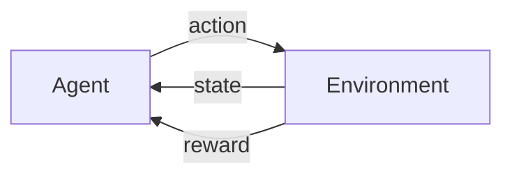

within reinforcement learning, there are mainly two entities -- agent and enviroment. agent is the entity which is being trained and environment is the entity where the agent explores and performs its actions. apart from agent and environment, there are 3 other core components aka communication channels which combinded completes the RL agent cycle:

- **state** - state is the piece of information which gives the complete picture of the environment i.e. true configuration of the environment
- **action** – actions which are performed by the agent on the enviroment. ex: in the context of an RL agent trying to learn how to play super mario bro, an action could be moving left/right or jumping. there are either be discrete set of actions which an agent perfom or continous based on the problem which is being tackled, and the actions which can be performed can also vary from state to state
- **reward** – after an agent performs an action, the environment computes reward. a reward basically tells how well _behaved_ and _aligned_ with the initial goal is the agent

within the RL agent cycle, everything happens on the basis of timesteps. at each timestep, the agent takes in the current state and performs an action. the environment computes reward and state for next timestep. the agent will take in the computed reward and tune its actions.

sometimes the agent might not be able to see the entirety of the environment i.e. partially observable environment. in such cases, the agent would receive an "observation" which is generated from the state via an observation function or distribution. observation is related to the agent's perception whereas state is related to the environment's dynamics.

## markov processes

in mathematics, a process is a family of objects which is indexed by another set. in the context of reinforcement learning, the index set would be usually time.

markov processes deals with stochastic processes. stochastic processes are collection of random variables indexed by another parameter (in this case, time). a markov process consists of a system which switches between different states based on some laws of dynamics (which is generally unknown) and these states form a sequence creating a chain.

within markov process, there are discrete set of states i.e. finite number of states and it uses integer for indexing i.e. discrete time.

the set of all possible states is called as state space and sequence of observations captured over time is known as history.

any stochastic process/system is called as markov process if it satisifies the markov property. the markov propertry states that **given the present, the future is conditionally independent of the past** i.e. current state of the system at $t$ is only dependent on state present at $t - 1$.

$$
P(X_{t+1} \; | \; X_t,X_{t-1},...,X_{0}) = P(X_{t+1} \; | \; X_{t})
$$

each state can transition from one another and it is based on some probabilistic value i.e. every pair of state has some transition probability. if all the transition probabilities are compiled then we get a transition matrix $T$. transition matrix is the one which defines the system's dynamics.

ex: if there are only two possible states $s_0$ and $s_1$. when the process is at $s_0$, there is a 75% chance at it remains at $s_0$ and 25% chance that it moves to $s_1$. when the process is at $s_1$, there is a 50-50 chance for transition. in this case, the transition matrix/model $T$ would be as follows:

$$
T = \begin{bmatrix}
0.75 & 0.25 \\
0.5 & 0.5
\end{bmatrix}
$$

where $T_{ij}$ is the transition probability for $s_i \to s_j$ ($i,\; j \in \{0, 1\}$)

a markov process is said to be stationary whose probabilistic behaviour does not change over time i.e. underlying distribution for transition matrix does not change over time.

$$
T_{ij}(t) = T_{ij}
$$

if the underlying distribution for transition matrix changes over time then it contradicts the markov propetry. the history for each episode can differ as they are randomly sampled from the transition model's underlying distribution however the probability of transition from $s_i$ to $s_j$ must remain the same over time.

### markov reward process

markov reward process (or) MRP is an extension of markov process with additional of rewards. along with states, observations and transition matrix, there would be another scalar value which is used to _judge_ the transition between states. reward is a scalar value which belongs to a subset of real values i.e. $R(s) = r \in \cal{R} \subset \mathbb{R}$, where $R$ is the reward function.

using concept of rewards, the agent can now know which states are more desirable than others and move together those states to receive higher rewards. rewards for various state transitions can be represented in the similar fashion as how transition matrix is represented.

apart from rewards, another value is introduced which is return. return is sum of rewards multiplied by a discount factor, which controls the _foresightedness_ of the agent in terms of rewards.

$$
G_t = \sum_{k = 0}^{T} \gamma^{k} R_{t + k + 1}
$$

where, $\gamma$ lies between 0 and 1. over here as we're dealing with episodic cases, we use $T$ as the upper bound instead of $\infty$ i.e. the process comes to an end when it reaches the terminal state.

discount factor aka $\gamma$ refers to how much the agent values future rewards compared to immediate rewards. if $\gamma$ is small then the agent cares more about immediate gratification whereas if $\gamma$ is high then agent cares more about long-term planning.

return by itself isn't that useful for knowing how _useful_ or _important_ the current state is i.e. if the agent started from the current state then what is the average amount of rewards which it'll accumulate? the reason behind this is that for the same state, there can be different trajectories leading to variation in return. to solve this problem, value of a state is introduced. value of a state $V(s)$ is the expected total discounted future reward, if the agent starts from state $s$

$$
V(s) = \mathbb{E}[G_{t} \; | \; S_{t} = s]
$$

### markov decision process

markov decision process (or) MDP can be considered as an extension of MRP with addition of actions i.e. the agent would no longer just passively observe the states of the system but it can now actively choose an action to take at every state transition.

there is a finite set of actions which can be executed and the set of all these actions is known as action space $\cal{A}$.

after adding actions, the transition matrix would no longer be 2D as going from $s_i$ to $s_j$ depends both on the initial state and also on the action which was taken. the transition matrix in MDP is 3D with dimensions as source state, action and target state i.e. $T_{ijk}$ would be the transition probability for going from $s_i$ to $s_k$ when $a_j$ action was taken. similarly, reward matrix also takes action into account now.

$$
P(S_{t+1}, R_{t+1} \; | \; S_{t}, A_{t}, S_{t-1}, A_{t-1}, ..., S_{0}, A_{0}) = P(S_{t+1}, R_{t+1} \; | \; S_{t}, A_{t})
$$

the above formula expresses the markov propetry in the case of markov decision processes (MDPs).

policy can be defined as the probability distribution over actions for every possible state. each policy can have varying amount of returns, hence it is important to find the optimal policy to maximize the returns.

$$
\pi(a|s) = P[A_t = a |S_t = s]
$$

and generally the optimal policy is denoted by $\pi^{*}$ i.e. policy which would return the maximum amount of return on average

$$
\pi^{*} = \underset{\pi}{\text{max}} \; \mathbb{E}_{\pi} [G_{t}]
$$

as we had value function in MRP, there are state-value $v(s)$ and action-value $q(s, a)$ functions in MDP

$$
v_{\pi}(s) = \mathbb{E}_{\pi}[G_t | S_t = s]
$$

$$
q_{\pi}(s, a) = \mathbb{E}_{\pi}[G_t | S_t = s, A_t = a]
$$

the state-value and action-value functions for optimal policy have a special behaviour

$$
v_{\pi^{*}}(s) \ge v_{\pi}(s) \; \; \; \text{for all } s \text{ and any } \pi
$$

$$
q_{\pi^{*}}(s, a) \ge q_{\pi}(s, a) \; \; \; \text{for all } s, a \text{ and any } \pi
$$

the goal behind finding the optimal policy is to follow along the path which increase the value functions

## taxonomy of RL methods

there are multiple different methods to solve a RL based problem and each of them can be categorize into the following groups:

- model-free or model-based
- value-based or policy-based
- on-policy or off-policy

in model-free methods, the agent doesn't require to model the environment or reward i.e. the agent takes in the current observations, does some computation and performs the optimal action. in model-based methods, the agent tries to _predict_ what would be the next observation/reward.

in value-based methods, the agent (_kinda_) calculates value for every possible action and picks the action with highest value. whereas, policy-based methods try to directly approximate the policy of the agent.

the main distinction between on-policy and off-policy methods is that off-policy can be considered as the _ability_ to learn from historical data which was either obtained by another agent/previous version of the same agent/demonstration by a human. on-policy methods require a fresh data for training and requires constant communication between the agent and the environment.

## cross-entropy method

reference: [The Cross Entropy method for Fast Policy Search](https://cdn.aaai.org/ICML/2003/ICML03-068.pdf)
 
implementation: [cross-entropy method on cartpole gym env](https://github.com/0xMukesh/paper-implementations/blob/main/src/rl/cartpole_cross_entropy_method.py)

cross-entropy method works very well in environment which doesn't require you to learn complex multistep policies and have short episodes with frequent rewards. cross-entropy method is model-free, policy-based and on-policy based method.

within cross-entropy method, a neural network is trained which acts like the policy which tells the agent which action is to be performed based on the current state. the policy is represented as a probability distribution over actions i.e. $\pi(a | s)$

the main idea behind cross-entropy is pretty simple and it can be described as:

- agent _plays_ around for N episodes i.e. feed the current observation of the environment to the neural network policy and pick a random action
- calculate the total reward for every episode
- decide a reward boundary i.e. all episodes which have total reward greater than equal to reward boundary are considered as "elite" episodes
- throw away all the episodes below reward boundary
- train further on the "elite" episodes with observations are the inputs and issued actions as the outputs

over here, total reward refers to total undiscounted reward per episode i.e. return with $\gamma$ = 1 starting from $t$ = 0

$$
R = G_{0} = \sum_{k = 0}^{T} r_{k}
$$

## resources

- [Deep Reinforcement Learning Hands-On](https://www.google.co.in/books/edition/Deep_Reinforcement_Learning_Hands_On/814wEQAAQBAJ)
- [Reinforcement Learning: An Introduction](http://incompleteideas.net/book/the-book.html)
- [Dissecting Reinforcement Learning](https://mpatacchiola.github.io/blog/2016/12/09/dissecting-reinforcement-learning.html)
- [Reinforcement Learning, By the Book](https://youtube.com/playlist?list=PLzvYlJMoZ02Dxtwe-MmH4nOB5jYlMGBjr)
