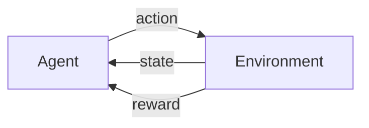

> [!warning]
> This is not a complete guide to reinforcement learning. These are my personal notes that will be updated as my understanding of reinforcement learning evolves.

Within reinforcement learning, there are mainly two entities — the agent and the environment. The agent is the entity which is being trained, and the environment is the entity where the agent explores and performs its actions. Apart from the agent and environment, there are three other core components, also known as communication channels, which combined complete the RL agent cycle:

- **state** — state is the piece of information which gives the complete picture of the environment, i.e., the true configuration of the environment.
- **action** — actions are performed by the agent on the environment. For example, in the context of an RL agent trying to learn how to play Super Mario Bros., an action could be moving left/right or jumping. There can either be a discrete set of actions which an agent performs or continuous actions depending on the problem which is being tackled, and the actions which can be performed can also vary from state to state.
- **reward** — after an agent performs an action, the environment computes a reward. A reward basically tells how well *behaved* and *aligned* with the initial goal the agent is.

Within the RL agent cycle, everything happens on the basis of timesteps. At each timestep, the agent takes in the current state and performs an action. The environment computes the reward and the state for the next timestep. The agent then takes in the computed reward and adjusts its actions.

```mermaid
flowchart LR
    agent[Agent]
    env[Environment]

    agent -->|action| env
    env -->|state| agent
    env -->|reward| agent
```

Sometimes the agent might not be able to see the entirety of the environment, i.e., a partially observable environment. In such cases, the agent would receive an "observation" which is generated from the state via an observation function or distribution. Observation is related to the agent's perception, whereas state is related to the environment's dynamics.

## markov processes

In mathematics, a process is a family of objects which is indexed by another set. In the context of reinforcement learning, the index set is usually time.

Markov processes deal with stochastic processes. Stochastic processes are collections of random variables indexed by another parameter (in this case, time). A Markov process consists of a system which switches between different states based on some laws of dynamics (which are generally unknown), and these states form a sequence creating a chain.

Within a Markov process, there is a discrete set of states, i.e., a finite number of states, and it uses integers for indexing, i.e., discrete time.

The set of all possible states is called the state space, and the sequence of observations captured over time is known as history.

Any stochastic process/system is called a Markov process if it satisfies the Markov property. The Markov property states that **given the present, the future is conditionally independent of the past**, i.e., the current state of the system at time $t$ is only dependent on the state present at $t - 1$.

$$
P(X_{t+1} \; | \; X_t,X_{t-1},...,X_{0}) = P(X_{t+1} \; | \; X_{t})
$$

Each state can transition from one to another, and this transition is based on some probabilistic value, i.e., every pair of states has some transition probability. If all the transition probabilities are compiled, then we get a transition matrix $T$. The transition matrix is the one which defines the system's dynamics.

Example: if there are only two possible states $s_0$ and $s_1$. When the process is at $s_0$, there is a 75% chance that it remains at $s_0$ and a 25% chance that it moves to $s_1$. When the process is at $s_1$, there is a 50–50 chance for transition. In this case, the transition matrix/model $T$ would be as follows:

$$
T = \begin{bmatrix}
0.75 & 0.25 \\
0.5 & 0.5
\end{bmatrix}
$$

where $T_{ij}$ is the transition probability for $s_i \to s_j$ ($i,\; j \in {0, 1}$).

A Markov process is said to be stationary if its probabilistic behavior does not change over time, i.e., the underlying distribution for the transition matrix does not change over time.

$$
T_{ij}(t) = T_{ij}
$$

If the underlying distribution for the transition matrix changes over time, then it contradicts the Markov property. The history for each episode can differ as they are randomly sampled from the transition model's underlying distribution\; however, the probability of transition from $s_i$ to $s_j$ must remain the same over time.

### markov reward process

A Markov reward process (or MRP) is an extension of a Markov process with the addition of rewards. Along with states, observations, and the transition matrix, there is another scalar value which is used to *judge* the transition between states. Reward is a scalar value which belongs to a subset of real values, i.e., $R(s) = r \in \cal{R} \subset \mathbb{R}$, where $R$ is the reward function.

Using the concept of rewards, the agent can now know which states are more desirable than others and move toward those states to receive higher rewards. Rewards for various state transitions can be represented in a similar fashion as how the transition matrix is represented.

Apart from rewards, another value is introduced which is return. Return is the sum of rewards multiplied by a discount factor, which controls the *foresightedness* of the agent in terms of rewards.

$$
G_t = \sum_{k = 0}^{T} \gamma^{k} r_{t + k + 1}
$$

where $\gamma$ lies between 0 and 1. Here, as we are dealing with episodic cases, we use $T$ as the upper bound instead of $\infty$, i.e., the process comes to an end when it reaches the terminal state.

The discount factor, denoted by $\gamma$, refers to how much the agent values future rewards compared to immediate rewards. If $\gamma$ is small, then the agent cares more about immediate gratification, whereas if $\gamma$ is high, then the agent cares more about long-term planning.

Return by itself is not very useful for knowing how *useful* or *important* the current state is, i.e., if the agent started from the current state, then what is the average amount of rewards which it will accumulate? The reason behind this is that for the same state, there can be different trajectories leading to variation in return. To solve this problem, the value of a state is introduced. The value of a state $v(s)$ is the expected total discounted future reward if the agent starts from state $s$.

$$
v(s) = \mathbb{E}[G_{t} \; | \; S_{t} = s]
$$

### markov decision process

A Markov decision process (or MDP) can be considered as an extension of an MRP with the addition of actions, i.e., the agent would no longer just passively observe the states of the system but can now actively choose an action to take at every state transition.

There is a finite set of actions which can be executed, and the set of all these actions is known as the action space $\cal{A}$.

After adding actions, the transition matrix would no longer be 2D, as going from $s_i$ to $s_j$ depends both on the initial state and also on the action which was taken. The transition matrix in an MDP is 3D, with dimensions as source state, action, and target state, i.e., $T_{ijk}$ would be the transition probability for going from $s_i$ to $s_k$ when action $a_j$ was taken. Similarly, the reward matrix also takes action into account.

$$
P(S_{t+1}, R_{t+1} \; | \; S_{t}, A_{t}, S_{t-1}, A_{t-1}, ..., S_{0}, A_{0}) = P(S_{t+1}, R_{t+1} \; | \; S_{t}, A_{t})
$$

The above formula expresses the Markov property in the case of Markov decision processes (MDPs).

A policy can be defined as the probability distribution over actions for every possible state. Each policy can have varying amounts of returns\; hence, it is important to find the optimal policy to maximize the returns.

$$
\pi(a|s) = P[A_t = a |S_t = s]
$$

The optimal policy is generally denoted by $\pi^{*}$, i.e., the policy which would return the maximum amount of return on average.

$$
\pi^{*} = \underset{\pi}{\text{max}} \; \mathbb{E}_{\pi} [G_{t}]
$$

As we had a value function in an MRP, there are state-value $v(s)$ and action-value $q(s, a)$ functions in an MDP.

$$
v_{\pi}(s) = \mathbb{E}_{\pi}[G_t | S_t = s]
$$

$$
q_{\pi}(s, a) = \mathbb{E}_{\pi}[G_t | S_t = s, A_t = a]
$$

The state-value and action-value functions for the optimal policy have a special behavior.

$$
v_{\pi^{*}}(s) \ge v_{\pi}(s) \; \text{for all } s \text{ and any } \pi
$$

$$
q_{\pi^{*}}(s, a) \ge q_{\pi}(s, a) \; \text{for all } s, a \text{ and any } \pi
$$

The goal behind finding the optimal policy is to follow the path which increases the value functions.

## taxonomy of RL methods

There are multiple different methods to solve an RL-based problem, and each of them can be categorized into the following groups:

* model-free or model-based
* value-based or policy-based
* on-policy or off-policy

In model-free methods, the agent does not require modeling the environment or reward, i.e., the agent takes in the current observations, performs some computation, and executes the optimal action. In model-based methods, the agent tries to *predict* what the next observation/reward would be.

In value-based methods, the agent (*roughly*) calculates the value for every possible action and picks the action with the highest value. Policy-based methods, on the other hand, try to directly approximate the policy of the agent.

The main distinction between on-policy and off-policy methods is that off-policy methods can be considered as having the *ability* to learn from historical data which was either obtained by another agent, a previous version of the same agent, or demonstration by a human. On-policy methods require fresh data for training and constant communication between the agent and the environment.

## cross-entropy method

reference: [The Cross Entropy method for Fast Policy Search](https://cdn.aaai.org/ICML/2003/ICML03-068.pdf)
implementation: [cross-entropy method on cartpole gym env](https://github.com/0xMukesh/paper-implementations/blob/main/src/rl/cartpole_cross_entropy_method.py)

The cross-entropy method works very well in environments which do not require learning complex multi-step policies and have short episodes with frequent rewards. The cross-entropy method is a model-free, policy-based, and on-policy method.

Within the cross-entropy method, a neural network is trained which acts as the policy that tells the agent which action should be performed based on the current state. The policy is represented as a probability distribution over actions, i.e., $\pi(a | s)$.

The main idea behind cross-entropy is simple and can be described as:

* the agent *plays* around for $N$ episodes, i.e., feed the current observation of the environment to the neural network policy and pick a random action
* calculate the total reward for every episode
* decide a reward boundary, i.e., all episodes which have total reward greater than or equal to the reward boundary are considered "elite" episodes
* discard all the episodes below the reward boundary
* train further on the "elite" episodes where observations are the inputs and issued actions are the outputs

Here, total reward refers to the total undiscounted reward per episode, i.e., return with $\gamma = 1$ starting from $t = 0$.

$$
R = G_{0} = \sum_{k = 0}^{T} r_{k}
$$

If the environment computes the rewards at the end of the episode (like in the Frozen Lake gym environment), then it could be a bit problematic to train it using the cross-entropy method. In the Frozen Lake gym environment, a reward of 1.0 is given if the agent reaches the bottom-right corner successfully and 0.0 if it fails to do so, and right after computing the reward, the episode finishes. The issue with such environments is that the reward does not tell how *good* the episode was, as there are no intermediate rewards like in CartPole. Due to this issue, while trying to select the elite episodes, a large chunk of bad episodes might be included, which would lead to instability in training and might even prevent convergence.

## bellman's equations

Before jumping into Bellman's equation of optimality, we need to get familiar with Bellman's equations for state-value and action-value functions.

### bellman equation for state-value function

In an MDP, the state-value function returns the expected cumulative future returns if started from state $s$.

$$
v_{\pi}(s) = \mathbb{E}_{\pi} [G_t | S_t = s]
$$

where $G_t$ is the return at timestep $t$ and it is defined as

$$
\begin{split}
G_t &= \sum_{k = 0}^{T} \gamma^{k} r_{t + k + 1} \\
&= r_{t + 1} + \gamma r_{t + 2} + \gamma^{2} r_{t + 3} + \; ... \; + \gamma^{T} r_{t + T + 1} \\
&= r_{t + 1} + \gamma G_{t + 1}
\end{split}
$$

If the above $G_t$ equation is substituted into the $v_{\pi}(s)$ equation,

$$
\begin{split}
v_{\pi}(s) &= \mathbb{E}_{\pi}[r_{t + 1} + \gamma G_{t + 1} | s] \\
&= \mathbb{E}_{\pi}[r_{t + 1} | s] + \gamma \mathbb{E}_{\pi}[G_{t + 1} | s] \\
&= \mathbb{E}_{\pi}[r_{t + 1} | s] + \gamma \mathbb{E}[\mathbb{E}_{\pi}[G_{t + 1} | S_{t + 1}] | s] \\
&= \mathbb{E}_{\pi}[r_{t + 1} | s] + \gamma \mathbb{E}[v_{\pi}(S_{t + 1}) | s]
\end{split}
$$

The above equation can be broken down and expressed with the help of transition probabilities as follows:

$$
\begin{split}
v_{\pi}(s) = \sum_{a \in \mathcal{A}} \pi(a | s) \sum_{s' \in \mathcal{S}} P(s'|s, a)[r + \gamma v_{\pi} (s')]
\end{split}
$$

### bellman equation for action-value function

In an MDP, the action-value function returns the expected cumulative future rewards if started from state $s$ and action $a$ is performed.

$$
q_{\pi}(s, a) = \mathbb{E}_{\pi}[G_t | S_t = s, A_t = a]
$$

Using the expansion of $G_t$ from the above section,

$$
\begin{split}
q_{\pi}(s, a) &= \mathbb{E}_{\pi}[r_{t + 1} + \gamma G_{t + 1} |s, a] \\
&= \mathbb{E}_{\pi}[r_{t + 1} | s, a] + \gamma \mathbb{E}_{\pi}[G_{t + 1} | s, a] \\
&= \mathbb{E}_{\pi}[r_{t + 1} | s, a] + \gamma \mathbb{E}[\mathbb{E}_{\pi}[G_{t + 1} | S_{t + 1}] | s, a] \\
&= \mathbb{E}_{\pi}[r_{t + 1} | s, a] + \gamma \mathbb{E}[v_{\pi}(S_{t + 1}) | s, a]
\end{split}
$$

Using the law of total probability,

$$
v_{\pi}(s) = \sum_{a \in \mathcal{A}} \pi(a | s) q_{\pi}(s, a)
$$

The above equation can be broken down and expressed with the help of transition probabilities as follows:

$$
q_{\pi}(s, a) = \sum_{s' \in \mathcal{S}} P(s' | s, a) [r + \gamma \sum_{a' \in \mathcal{A}} \pi(a'|s') q_{\pi}(s'|a')]
$$

If the policy is greedy, then $v_{\pi}(s)$ can be expressed in terms of $q_{\pi}(s, a)$ as

$$
v_{\pi}(s) = \max_{a \in \mathcal{A}} q_{\pi}(s, a)
$$

### bellman equation for optimal policy

Using the above Bellman equations for state-value and action-value functions, we can construct the Bellman optimality equations.

$$
v^{*}(s) = \max_{a \in \mathcal{A}} \sum_{s' \in \mathcal{S}} P(s'|s, a)[r + \gamma v^{*}_{\pi} (s')]
$$

$$
q^{*}(s, a) = \sum_{s' \in \mathcal{S}} P(s'|s, a)[r + \gamma \sum_{a' \in \mathcal{A}} \max_{a' \in \mathcal{A}} q^{*}_{\pi}(s' | a')]
$$

> **NOTE**: In the above equations, $v^{*}$ and $q^{*}$ are present on both sides of the equations, i.e., they are recursive in nature.

## value iteration method

The value iteration method is a technique to solve the Bellman optimality equation using dynamic programming. In the value iteration method, the Bellman optimality equation related to the state-value function is converted into an update rule using which $v^{*}(s)$ is continuously refined iteratively.

$$
v_{i+1}(s) \leftarrow \max_{a \in \mathcal{A}} \sum_{s' \in \mathcal{S}} P(s'|s, a)[r + \gamma v_{i} (s')]
$$

At the start of the iteration, the value is set to 0 for all states, i.e., $v_{0}(s) = 0$.

This method works well when the state space is discrete and small enough to perform multiple iterations over it. Apart from that, in practice, we generally do not have access to the transition probabilities, i.e., $P(s' | s, a)$, so instead they are estimated by keeping track of the history.

## resources

* [Deep Reinforcement Learning Hands-On](https://www.google.co.in/books/edition/Deep_Reinforcement_Learning_Hands_On/814wEQAAQBAJ)
* [Reinforcement Learning: An Introduction](http://incompleteideas.net/book/the-book.html)
* [Dissecting Reinforcement Learning](https://mpatacchiola.github.io/blog/2016/12/09/dissecting-reinforcement-learning.html)
* [Reinforcement Learning, By the Book](https://youtube.com/playlist?list=PLzvYlJMoZ02Dxtwe-MmH4nOB5jYlMGBjr)
